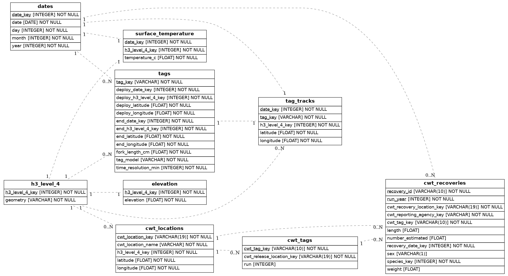
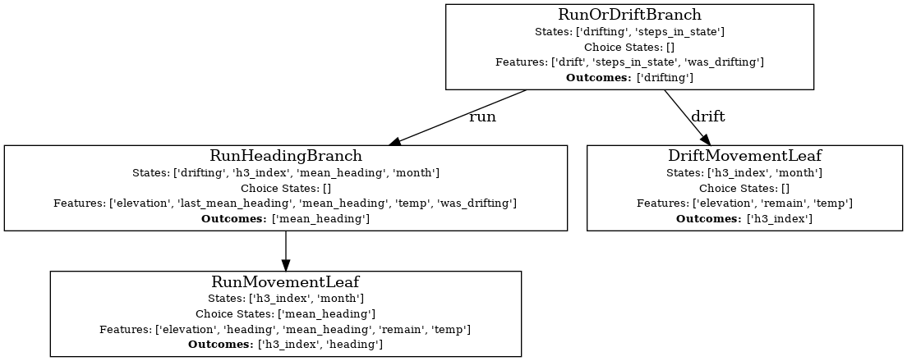

# March 22, 2024

## Changeset 

### Incorporating and Preparing for New Data

> TL;DR 
> - The database/datamodel has been standardized explicitly in code
> - Created pipelines for all known data import/upload
> - Every step of the import/upload process is now being tested
> - CWT data is now incorporated in the database
> - Can auto generate an ERD

Two driving goals at the moment are to:

1. Incorporate information on natal home migrations
2. Incorporate information on earlier marine life stages

For the latter, I read through a few papers on the subject and discovered that most (if not all) take advantage of the Coded Wire Tag (CWT) data that's been collected for a *long* while. Therefore I've gone ahead and setup pipelines to [incorporate the CWT data](https://github.com/networkearth/mirrorverse/issues/15) into the data model that I'm using.

For the former I realized that given how squirrelly my current data import scripts for the tagging data are that it would be a good idea to get all of that cleaned up as well in preparation for importing the new data that I received yesterday (thanks Michael!). That led to a whole series of tickets - [tagging data](https://github.com/networkearth/mirrorverse/issues/16), [elevation data](https://github.com/networkearth/mirrorverse/issues/17), [surface temperature data](https://github.com/networkearth/mirrorverse/issues/18).

As I was (re)building these data import pipelines I decided to take a little bit of extra time to allow for the following:

1. **Database Schema as Code** (using `sqlalchemy`): rather than having the schema's be hidden implicitly in the uploader code I've encoded it directly as `sqlalchemy` "Models" so that we can:
    - Ensure we're adding column contraints such as foreign keys, not null constraints, and actually include primary keys to ensure we don't upload duplicates by accident
    - Allow for testing against the schemas so that before we upload data we've tested the upload is going to make sense.
    - Allow for building database schemas from scratch really easily (this will allow us to migrate database schemas, create testing databases, and do "infrastructure as code" style deployments of new tables)
2. **Auto Documentation**: with the schema as code I was able to use `eralchemy` to auto generate an ERD (entity relationship diagram) which can be seen below. This will be super in helpful in making sure I keep all the data straight.
3. **Testing Each Step of the Way**: Rather than just having some scripts lying around I've now got code that's tested at each step of the way (functional and integration). Furthermore, as mentioned above, we can create mirrors of the real database and test data upload to them to make sure we work out any issues before deploying data to a real database.
4. **Data Version Controlled Flows**: Before you had to know in which order to run my scripts to not break things. Now thanks to using `dvc` (data version control) I've setup pipelines that will check to make sure you're running things in the right order for you. Given all the relationships between these tables this turns out to be super important.

All in all there is now a [warehouse](https://github.com/networkearth/mirrorverse/tree/c2c43428deba04abadce9ac59ed760263e891161/mirrorverse/warehouse) with all the code required to manage and describe the database/datamodel and a series of [upload pipelines](https://github.com/networkearth/mirrorverse/tree/c2c43428deba04abadce9ac59ed760263e891161/pipelines/upload) for taking data and pushing it up into the database of your choosing. 

Likewise there is a place for all of the code for [importing from other sources](https://github.com/networkearth/mirrorverse/tree/c2c43428deba04abadce9ac59ed760263e891161/mirrorverse/docks) and prepping the data for the database and there are [pipelines](https://github.com/networkearth/mirrorverse/tree/c2c43428deba04abadce9ac59ed760263e891161/pipelines/import) for these operations too. 

### Cleaning up the Modeling

There were a series of issues with the current setup of the choice model that was making development difficult:

- **Training Took Forever**: this was largely due to the fact that I'd retrain all models every time I changed how the data looked rather than just the models that needed retraining. Solved that with this [ticket](https://github.com/networkearth/mirrorverse/issues/7). There is now an explicit pipeline each for [training](https://github.com/networkearth/mirrorverse/tree/c2c43428deba04abadce9ac59ed760263e891161/pipelines/chinook/train) and [simulation](https://github.com/networkearth/mirrorverse/tree/c2c43428deba04abadce9ac59ed760263e891161/pipelines/chinook/simulate) that will keep track of what needs to be updated and what's good to stay the same for you. 
- **Passing Data Through was Clumsy**: not much to say here except that it's [solved](https://github.com/networkearth/mirrorverse/issues/4).
- **Wanted Auto Documentation for the IBM**: [Solved!](https://github.com/networkearth/mirrorverse/issues/8) See below.

### DevOps

Given there are now a whole slew of tests I [setup automated testing through git actions](https://github.com/networkearth/mirrorverse/issues/11) and just threw in linting (ensuring the code is well formatted) as well. Now for every commit to the code base there will be a little check mark if that code passed muster!

## It's Not All Code

Had a great convo with Michael this week and gots loads and loads of resources from him to look through. So definitely looking forward to digging through all of those papers. 

## Up Next

