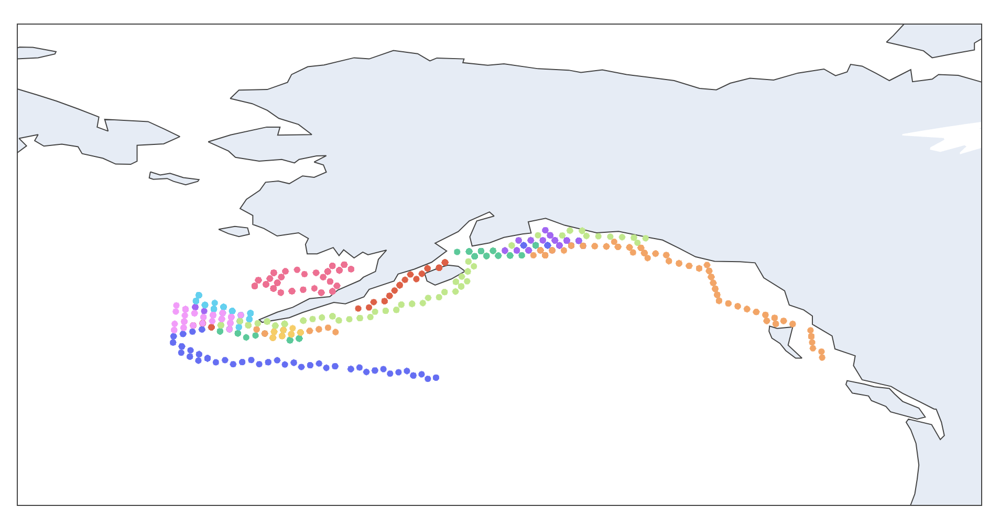
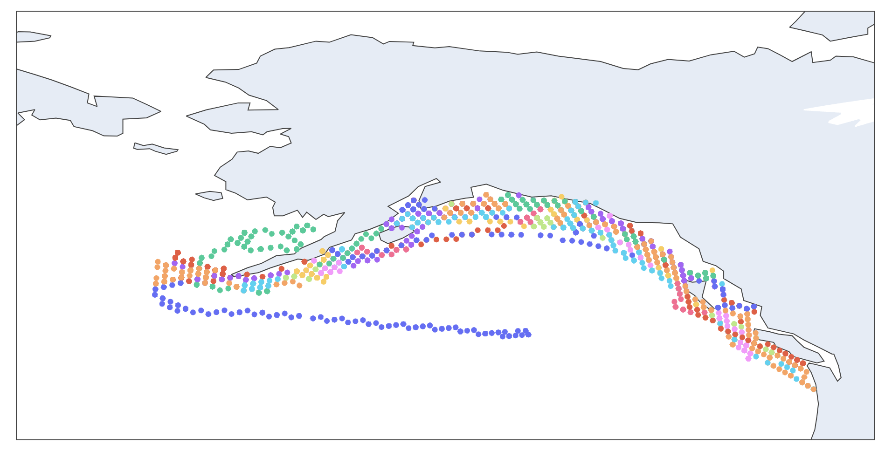
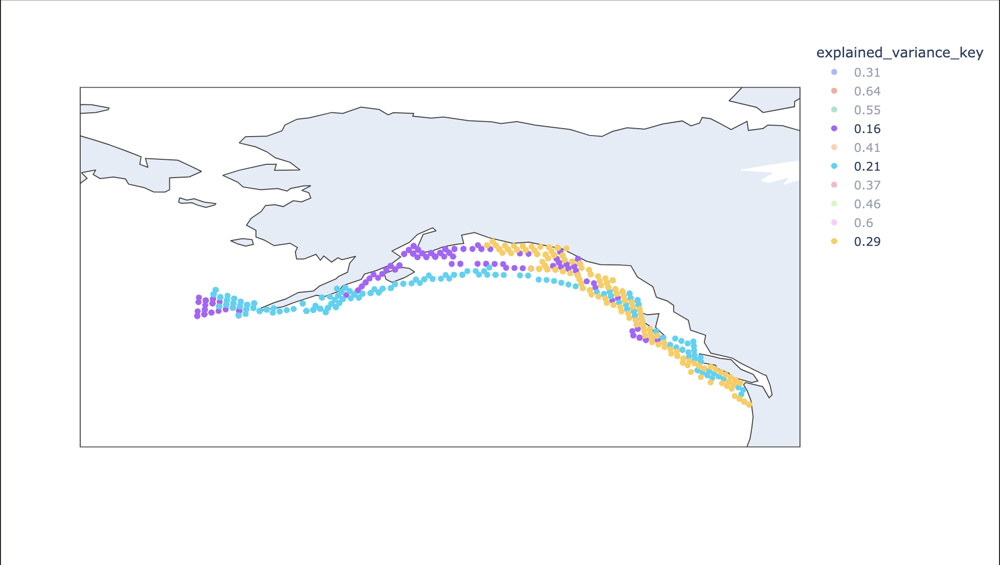
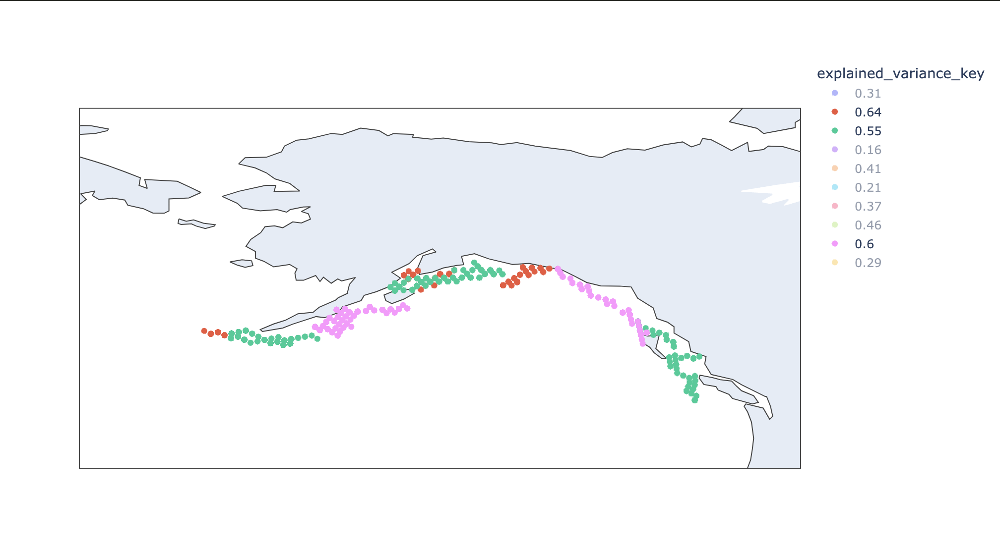

# March 29, 2024

## Changeset

### TL;DR

- With the new information from Michael I realized I have a problem in my model before even considering homing behavior. [Details](#this-weeks-quandry)
- This led me to realizing I was predicting the wrong thing (global probability instead of choice utility)
- I had to develop an algorithm to enable training a utility function using standard ML methods. [Details](#predicting-utility)
- Then I ran into convergence and debugging issues with this new algorithm that I had to solve. [Details](#convergence)
- Finally, I put together a genetic algorithm for grouping individuals by how well or poorly they match the utility function. [Details](#the-choice-correlation-problem)
- And as a result was able to discover that my model seems to be having issues because there are two distinct modes of "going on a run" that I need to be able to distinguish in the model. [Details](#a-result)

### Tickets/PRs

- [Predicting Utility](https://github.com/networkearth/mirrorverse/pull/26)
- [Convergence Fixes + Genetic Algorithm](https://github.com/networkearth/mirrorverse/pull/27)

### This Week's Quandry

After my conversation with Michael last week and all of my reading I realized that there was a quick an easy way to tell if I had runs that *weren't* home runs - look at winter months. This is what I saw for the months November - February:

Now originally I thought that the reason I wasn't picking up on nice, long runs was simply because I couldn't distinguish between natal homing runs and foraging movements. But this would suggest that no, the problem remains even when I focus on times when no such distinction should exist. 

So I started asking myself, why isn't the model picking up on all of this? I don't yet have an answer because as a result of thinking about this question I realized I had a significant bug - while I've been talking about predicting a utility function, I've actually been predicting global choice probabilities... And this sent me down the whole road of "well how does one go about predicting utility and making sense of the results?"

Todays' Fishy Friday is my answer to that question.

### Predicting Utility

As I've stated elsewhere we're not actually interested in predicting the most likely choice but instead want to predict the likelihoods of all the choices in front of a creature. Why? Because we want to incorporate this variability and error into our model (as our model is supposed to be a generative process). However we're not predicting the probability for a series of choices directly. Why not? For two reasons. Let's start with the first. 

Suppose we predicted, for each individual decision the probability that that decision is selected. Because we're doing this independently of the other decisions this will end up being the probability that the decision is selected globally. This immediately removes any possibility that we can flex the probability on the basis of what other choices are present. There is one probability for this decision, period. So, say I'm presented with a bunch of bad decisions. All the probabilities are low and perhaps sum to less than one. Then actually, all my probabilities are wrong for this decision and my prediction is therefore off. I'm using my predictions in a way that violates how they were trained.

Okay so suppose instead we didn't try to predict in isolation - instead we went ahead and predicted for all choices at once. Here, in our case enters the curse of dimensionality. Suppose you're trying to pick a head for a migratory movement. There are quite a few choices in front of you and all of them are going to have a series of features attendant to them. This quickly results in loads of features, and the more features you have the more flexible your model needs to be, and the more flexible your model the more data you need - and in the case of individual creature biology there often pretty hard limits on the amount of information available. Therefore it'd really be much better for the accuracy of our model if we could predict choice by choice instead of across all choices at once. 

Enter a utility function. A utility function gives you a value for each choice that is indeed global. But, instead of taking it at face value as a probability, you instead use it as a kind of odds. If the utility for one choice is 50 and for another 25 you will choose the former twice as often as the latter. So to derive the probabilities of selecting any one of our choices in a given decision we simply divide our individual utility values by the sum of utility across our choices (for that specific decision). This allows our probability to vary with our context while still having one single global value.

There's just one problem. We have no data that would allow us to train a utility model because utility is about relative odds and all we have are 1's and 0's (for choices selected and choices passed). 

Now you might imagine that we could group our like choices together and start computing ratios in some way but in the case of continuous choices this doesn't work out so well - indeed we may never see a specific choice made twice (maybe everyone always chooses a slightly different direction to move in). Point being we cannot depend on getting ratios we can train a model with directly from our data. So what are we to do?

I believe there's an odd game we can play to iterate ourselves into a dataset. To see how this would work let's take an example.

Let's suppose I've gathered data on 5 decisions I've made about what to eat in the past week. In the first I had a choice between pizza and a sandwich and I decided to order a sandwich (we'll represent this as 0, 1 for no to pizza and yes to sandwich). Then in the second choice I had no choice and could only get pizza (represented as 1, \_). In the third and fourth I had pizza and no sandwich (1, 0). And finally I went to a sub shop and got a sandwich because it was the only option (\_, 1).

Now let's suppose I give a utility of 1 to each of my options. We'd end up with something like the following:

| Decision | 0, 1 | 1, _ | 1, 0 | 1, 0 | _, 1 |
| --- | --- | --- | --- | --- | --- |
| Round 1 |
| Utility | 1, 1 | 1, _ | 1, 1| 1, 1| _, 1|
| Probabilities| .5, .5 | 1, _ | .5, .5 | .5, .5 | _, 1 |

Now here comes the game. First, suppose that for whichever was selected you "win" the difference between 1 and what you predicted the probability was and for each that wasn't selected you "lose" whatever probability you predicted.

| Decision | 0, 1 | 1, _ | 1, 0 | 1, 0 | _, 1 |
| --- | --- | --- | --- | --- | --- |
| Round 1 |
| Utility | 1, 1 | 1, _ | 1, 1| 1, 1| _, 1|
| Probabilities| .5, .5 | 1, _ | .5, .5 | .5, .5 | _, 1 |
| Wins/Losses | -0.5, 0.5 | 0, _ | 0.5, -0.5 | 0.5, -0.5 | _, 0|

Now for each column we take the utility for each choice and modify it as:

$$U_{i+1} = U_{i}(1 + w)$$

where $w$ is what it won or lost.

| Decision | 0, 1 | 1, _ | 1, 0 | 1, 0 | _, 1 |
| --- | --- | --- | --- | --- | --- |
| Round 1 |
| Utility | 1, 1 | 1, _ | 1, 1| 1, 1| _, 1|
| Probabilities| .5, .5 | 1, _ | .5, .5 | .5, .5 | _, 1 |
| Wins/Losses | -0.5, 0.5 | 0, _ | 0.5, -0.5 | 0.5, -0.5 | _, 0|
| New Utility | 0.5, 1.5 | 1, _ | 1.5, 0.5 | 1.5, 0.5 | _, 1|

So now what? Well the last part of this game would be to train our model on the "New Utility" column. Assuming, for now, that our model predicts one utility for pizza and one for sandwich we have:

$$pizza=(0.5 + 1 + 1.5 + 1.5)/4=1.125$$
$$sandwich=(1.5 + 0.5 + 0.5 + 1)/4=0.875$$

So we increased the utility of pizza and dropped the utility of sandwiches which makes sense given that pizza is indeed the more likely option when paired with sandwich as a choice. So far so good! But what happens when we get to the utility we would expect (2 vs 1)?

| Decision | 0, 1 | 1, _ | 1, 0 | 1, 0 | _, 1 |
| --- | --- | --- | --- | --- | --- |
| Round N |
| Utility | 2, 1 | 2, _ | 2, 1| 2, 1| _, 1|
| Probabilities| 2/3, 1/3 | 1, _ | 2/3, 1/3 | 2/3, 1/3 | _, 1 |
| Wins/Losses | -2/3, 2/3 | 0, _ | 1/3, -1/3 | 1/3, -1/3 | _, 0|
| New Utility | 2/3, 5/3 | 2, _ | 8/3, 2/3 | 8/3, 2/3 | _, 1|

$$pizza=(2/3 + 2 + 8/3 + 8/3)/4=2$$
$$sandwich=(5/3 + 2/3 + 2/3 + 1)/4=1$$

The overall utility (from our model) doesn't change!

And what about if we shoot past and choose (3, 1) as our utilities?

| Decision | 0, 1 | 1, _ | 1, 0 | 1, 0 | _, 1 |
| --- | --- | --- | --- | --- | --- |
| Round M |
| Utility | 3, 1 | 3, _ | 3, 1| 3, 1| _, 1|
| Probabilities| 3/4, 1/4 | 1, _ | 3/4, 1/4 | 3/4, 1/4 | _, 1 |
| Wins/Losses | -3/4, 3/4 | 0, _ | 1/4, -1/4 | 1/4, -1/4 | _, 0|
| New Utility | 3/4, 7/4 | 3, _ | 15/4, 3/4 | 15/4, 3/4 | _, 1|

$$pizza=(3/4 + 3 + 15/4 + 15/4)/4=2.8125$$
$$sandwich=(7/4 + 3/4 + 3/4 + 1)/4=1.0625$$

Which is once again in the right direction. 

The basic idea here is that your utility is changed heavily when it is placed in a decision that is counter to itself. So if the utility is very high but is placed in a decision where it's corresponding choice was not made the game attempts to drop the utility quite dramatically. Likewise if the utility was very low but placed in a decision where it's choice was selected then the game attempts to bump up the utility dramatically. However if the utility is generally on the money, for each large failure, there will be several small successes to balance it out. However as you get closer and closer to being right on (i.e. predicting 100% probability) in those wins not only do your failures get larger but your individual wins get smaller. And therefore upon repeating this game over and over your utility will "search" for a balance. 

This update function:

$$U_{i+1} = U_{i}(1 + w)$$

means that the balance will be found when the effective sum of your wins and losses are zero (assuming your model is solving for means) which happens to be the balance point we want. 

So let's formalize the steps of the game.

1. Assume even utility across the board.
2. Create the "New Utility" row.
3. Train a model that aims for means on the "New Utility" row.
4. Play another round with the new utilities. 

If we keep playing this game eventually we'll converge to the real utility function. What's awesome about this is that so long as our model is aiming for means (and therefore additively weighting wins and losses) we would expect this process to converge regardless of the model we are using! If our model predicts the utility too high on some set of choices it will get overall losses and therefore will get a new dataset that will force a drop in the utility function for those choices. If it predicts too low the opposite will happen. Therefore this process should allow the dataset+model pairing to correct itself. Indeed we expect this process to be nice and smooth because updates near the optimum will be very small (as at the optimum the update is zero). 

#### Convergence

One issue with this whole process (taken as is) is that convergence can get really slow. The reason for this is simple - because at the optimum our update is zero, near our optimum our update is also near zero. This can mean that it takes an inordinate number of iterations to reach the level of convergence we want.

However consider the fact that an update for a given utility is given (in theory) by:

$$U_{n+1}=U_{n}\frac{N+\sum_N w_i}{N}$$

where $N$ is the number of times the choice our $U$ corresponds to shows up in our data. This clearly shows that $\sum_N w_i$ totally controls how large our updates are to $U$ at each step. Now we could consider simply multiplying $w_i$ with some positive constant $\alpha$ to get:

$$U_{n+1}=U_{n}\frac{N+\alpha \sum_N w_i}{N}$$

Certainly this will make the step changes more dramatic, right? The problem comes when $\sum_N w_i < 0$ if in this case $\alpha \sum_N w_i \leq -N$ we'll end up with $U_{n+1}\leq 0$ which breaks our entire process. 

However we can avoid this if we choose $\alpha < 1 / |\min{w_i}|$ because then, even if all the $w_i = \min{w_i}$ we have that $\alpha \sum_N w_i > 1 / |\min{w_i}| \sum_N \min{w_i} > -N$. 

However we don't really know what the groupings will be, so instead we need to look at the global $\min{w}$ and multiply all of our weights by an $\alpha$ that is as close to $1/|\min{w}|$ without actually meeting or going over it. Because all the $|w|$ are fractions their inverses will all be greater than $1$ and so we'll have the effect of making our update to $U$ as large as possible. 

#### Checking the Model

We've talked about the fact that $U$ is not at all a probability. So how on earth do we check to see whether our $U$ is working well or not? How do we run diagnoses of our model? The answer is actually pretty straightforward, instead of comparing our utility to a probability, we instead have to convert our $U$ to a probability (by getting all options in a decision and normalizing against the sum of utility) and then we can compare those probabilities to see how well our model is doing. Our process above is driven by convergence of probabilities, so, up to the ability of our model features to divvy up the space our model should be able to predict those probabilities as well. Obviously if we are comparing the probabilities of two groups that our model (for either generalization or lack of feature reasons) can't distinguish, then we wouldn't expect those probabilities to line up. 

But, this does mean that using the probability as our target when doing standard model comparisons should work. 

### The Choice Correlation Problem

#### The Problem

Imagine a situation where you are studying the choices people make when they come into a coffee shop. Most of the time (barring shortages and other errors) there is always coffee, chai, and hot chocolate on the menu. But sometimes there'll be extras - like smoothies in the summer or cider in the fall. So you've decided to use utility instead of probability so that you can contextualize the preferences in choice making. 

Perhaps at the end of all of this you build a simple utility model that gives a single value to each drink and calls it a day. What it predicts is that the utility of coffee is 4 times higher than the utility of hot chocolate - i.e. for every 4 coffees bought, only one hot chocolate is bought. And after having spent so much time in the coffee shop you know this is true. However, you've also noticed something else which is troubling. 

What you've observed is that everyone has a regular drink. Those who drink coffee almost always buy themselves coffee. Those who drink hot chocolate always drink hot chocolate. 

What's going on here?

The answer is simple, just because you've described a utility function that is good at predicting the *population* accurately, it neededn't predict individuals well. Why? Because often times choices are correlated whereas when we've been building our utility models we've just been collected choices from every which where we can. In doing so the correlations have been lost as "noise" that our utility models cannot fit to. 

So what to do? Well we can add features to account for this. Like in this example we could simply add a "regular drink" feature to our utility and it would quickly learn that there is little to no difference in utility between hot chocolate and coffee - what matters is what people have gotten used to drinking.

Problem is this - this loss of correlation can happen in any situation and it may not be obvious how to resolve it, or even that it's happening from squinting at the data alone. So what we need is a robust way to search for and recover lost choice correlations. 

#### The Solution

Thankfully the solution here is pretty apparent given the example we just went through. The way to find lost correlation is to find individuals who are poorly represented by our utility function. 

Problem is we'd expect this for everyone given there is always going to be "choice noise". So how do we tell what's a patterned lost correlation vs just plain noise? 

Well if were to put all our coffee drinkers in a group, even though we have a large population of individuals we'd still have poor results compared to our overall population performance. Likewise for the hot chocolate drinkers. However if we created a group of hot chocolate and coffee drinkers we know that that group would be similar to the overall population and therefore probably look alright. So the key here *is to find the right groupings of individuals so as to maximize the average difference between our population performance and the group performance*. 

So we have a clustering problem. But unlike most clustering we have no distance between individuals, we just have a "value of a cluster". And this is unfortunate because all clustering algorithms I know about require a measure of distance. So instead I decided to treat this as an optimization problem and built a genetic algorithm that takes the data we want to cluster, a desired number of groups, and some configuration (which has defaults) and gives you back the groups and their individual scores. 

All in all we have a tool for looking for groups that are the most different and/or most similar to our model of utility. 

And this led to something pretty interesting.

#### A Result

What led me down this whole path was frustration with how "squirrelly" my predictions are compared to the nice, long runs of the "actuals".  

Actuals

Simulation

Well what I did was use the genetic algorithm to group individuals by how well or poorly the utility model captured their movement choices while on a "run" (just a longer directed movement). What I found was super illuminating. 

Here are the worst represented groups:

And here are the best represented:

And what do you know! They seem to divide along the lines of how "squirrelly" the runs are! 

So this now brings us right back to the question that startd us down this path. Except now instead of just scratching my head and wondering what on earth can be going on I've got two distinct groups of fish, expressing two very different behaviors, and to untangle what's going wrong with my model I've got to understand what makes these two groups (predictably) different. 

## Up Next

- What's going on with these two modes of behavior? 

