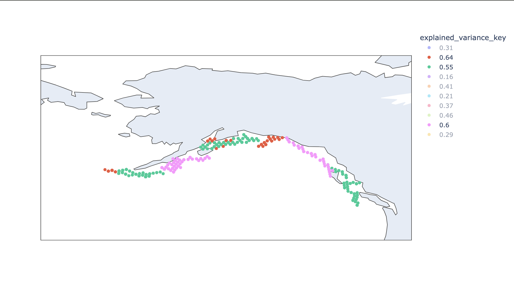
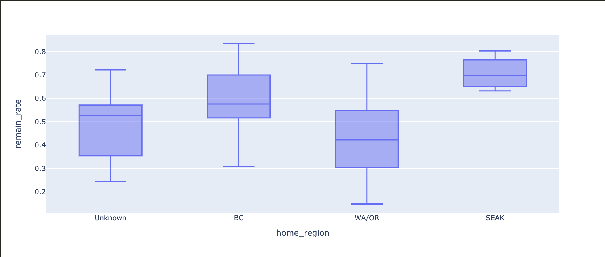

# April 5, 2024

## Changeset

### TL;DR

### Tickets/PR's

### A Tale of Two Fish

Last week I noted that when looking at movement choices while on a "run" there were groups that we poorly explained by the model:

And groups that were well explained by the model:

And noted that this was at least partially culpable for the "squirrely" behavior of the model as compared to reality. 

So I started the week with some digging into these two groups and rather quickly discovered something interesting. In my discretization of space there is the obvious result that fish don't always "move". Indeed they may be moving but if they don't leave their discreete cell of space then the model considers them as fixed in space for that epoch. This leads to the notion of a choice to "remain" within the model. During a run fish will, depending on how quickly they are moving at any time, either "remain" a lot or a little. And when I plotted a histogram of the remain rate per fish split by whether the model did a good of explaining their behavior during a run or not (explained variance > 0.4) I got the following:

which is one of the clearest patterns I think I've ever seen while debugging a model... 

What it means is that the model is very good at explaining fish where the remain rate is greater than 50% and not good at explaining fish below that rate. I.e. fish that swim faster the model is not explaining well. 

So of course the next thing I wondered was - how variable are the remain rates over time for a single fish? 

So I took a rolling window of 10 timesteps and computed the remain per fish during as a function of time:

Each new color is a new fish and the y-axis is the remain rate as a function of time (nominally the index). 

So there's quite a bit of variation but we can still see this pattern that for those that are well explained the remain rate is generally higher. 

Then I asked myself, how well could you model tracks like these through "remain rate space" as a biased coin flip? I.e. if at each moment I have a certain probability to stay or not will I end up with a graph that looks like the above?

Here's what it looks like for a remain probability of ~42%

And here's what it looks like for a remain probability of ~68%

Similar enough to allow me to suppose that *all I need to predict is the average remain rate per fish*. 

So now the question remaining was - do I have any information that is predictive of a fish's average remain rate while on a run?

Home region definitely stood out:

SEAK fish are real slow :) 

I also looked at months but didn't find much of a pattern in the medians (although perhaps some of the extremes become more or less likely):

Fork length was a similar story (divided into three even groups of fish by fork length)

Let's now see if any of this can help us by turning to the model itself. 

Went ahead and added the home region as a categorical feature to the random forest in the run movement node and then was able to show it does a reasonably good job splitting these regions up:

Predicted mean rate is the average probability given to a "remain" action. Actual mean rate is the rate at which the "remain" action was actually chosen. Obviously there are other things going on here so they won't be exactly the same but the model captures the movement between groups. 

So then at this point I regrouped and looked at well vs poorly explained again... and found this...

Some small amount of mixing but otherwise the exact same problem we were left with before!

Indeed this carriers into each of the individual groups as well. 

So then I looked to see how poorly we're predicting the individual remain rates:

and while we definitely struggle on the lower end given all we have is home region at this point, this seems alrightish... 

So what's going on?

### Hierarchies of Decision Making

Eventually after looking at a lot of different ways of slicing this data I realized something, there are in effect two modes of operation baked into this one model. 

On the one hand you have the decision to stay or go. But if you choose to go there are usually about 4-5 directions that you realistically have a chance of choosing given the heading is already given to you and the discretization of directions that I've chosen. 

But what this means is that you've got this one large probability attached to remaining and a bunch of smaller even probabilities attached to the directions you might move in if you choose to go. 

And that means that you're explained variance on the "go" point is just going to be lower because there are far more "options" that are all reasonably probable. However if you're the kind of fish that doesn't often "go" (i.e. moves slowly) then you don't have to suffer getting a "bad score" (even though it's the score we'd expect) quite so often. Whereas if you're a fish that moves much faster you're suffering more of these less probable and therefore harder to predict choices.

So when our genetic algorithm is grouping folks by how hard they are to predict they are literally finding the fish less predictable because they move more often. 

In theory then if we were to remove the stay or go decision and put it in another node, our groupings would suddenly have less to do with remain rates. 

To test this (before going and implementing a new node) I just removed the remain choice from the options (and just removed cases where the remain choice was chosen), retrained the model, and regrouped on the results. This is what I got (WARNING: plotly flipped the colors on me, blue is now well explained):

And this is honestly what I'd expect given the data - fish the move faster tend to be more directed and therefore easier to predict. While the pattern is much less strong than before there is some of that tendancy now. 

One mystery solved... So now time to add a node to our tree!

### Dangerous Features

So after adding the node things didn't exactly get better... Yes there were nice long runs present (as well as short ones depending on where the fish is from) but all of this had sort
of illumated another problem - the runs were going in all sorts of directions!

For example here's the points while on runs colored by their heading direction:

vs the same for our real data:

And even if I threw in latitude and longitude as features the situation did not improve! So what on earth was going on?

Turns out the problem was twofold. First 95% of the points on runs are simply following a given heading, i.e. changes happen only 5% of the time. And when they do on a run, they change only very slightly. So initialization, the only real "heading choice" happens <5% of the time. 

Second I had incorporated a feature called `diff_heading` which gives, for any considered heading, the difference (in smallest separating angle) between that and the last heading. This is obviously an exceptionally useful feature for keeping things on track but it turns out it's a bit too useful...

Specifically `diff_heading` is effectively all you need to explain the 95%+ of fish on a run that's already been initialized that I mentioned just above. Which means the model just literally throws out any other features! This is why when I added lat and lon the model didn't change - it didn't have any use for the features.

Unfortunately that <5% of the time when initialization does happen the `diff_heading` is obviously useless and the model just picks a random direction. Thus leading to our totally random directions... 

So just as a sanity check I trained a model without `diff_heading` but with lat and lon and found this:

So clearly the utility model can work! But only with the right features. `diff_heading` must go. 

Turns out you can find most of the pattern from home region, month, and elevation:

### In the End

I went ahead and added home region to pretty much all of the other models and this was the end result of everything described thus far:

Reality:

Simulation:

Now there's something really annoying happening in the south/east where because I'm discretizing space the coast line gets fuzzy, fish start wandering on land, and then everything goes haywire. But if we imagine masking that out with some kind of "choice not allowed" filter and pay attention to the marine areas this thing doesn't look half bad. 

