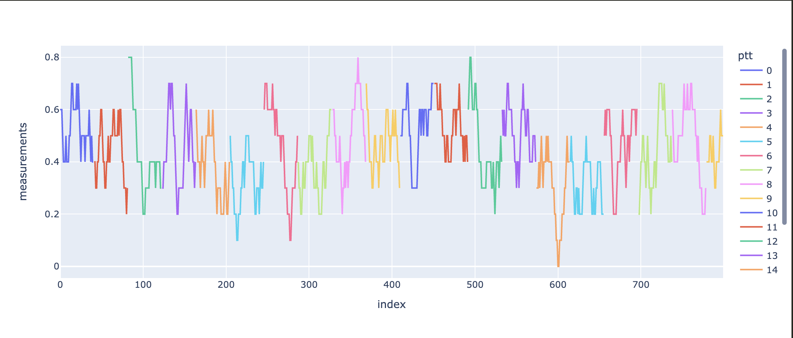

# April 5, 2024

## Changeset

### TL;DR

### Tickets/PR's

### A Tale of Two Fish

Last week I noted that when looking at movement choices while on a "run" there were groups that we poorly explained by the model:

And groups that were well explained by the model:

And noted that this was at least partially culpable for the "squirrely" behavior of the model as compared to reality. 

So I started the week with some digging into these two groups and rather quickly discovered something interesting. In my discretization of space there is the obvious result that fish don't always "move". Indeed they may be moving but if they don't leave their discreete cell of space then the model considers them as fixed in space for that epoch. This leads to the notion of a choice to "remain" within the model. During a run fish will, depending on how quickly they are moving at any time, either "remain" a lot or a little. And when I plotted a histogram of the remain rate per fish split by whether the model did a good of explaining their behavior during a run or not (explained variance > 0.4) I got the following:

which is one of the clearest patterns I think I've ever seen while debugging a model... 

What it means is that the model is very good at explaining fish where the remain rate is greater than 50% and not good at explaining fish below that rate. I.e. fish that swim faster the model is not explaining well. 

So of course the next thing I wondered was - how variable are the remain rates over time for a single fish? 

So I took a rolling window of 10 timesteps and computed the remain per fish during as a function of time:

Each new color is a new fish and the y-axis is the remain rate as a function of time (nominally the index). 

So there's quite a bit of variation but we can still see this pattern that for those that are well explained the remain rate is generally higher. 

Then I asked myself, how well could you model tracks like these through "remain rate space" as a biased coin flip? I.e. if at each moment I have a certain probability to stay or not will I end up with a graph that looks like the above?

Here's what it looks like for a remain probability of ~42%

And here's what it looks like for a remain probability of ~68%

Similar enough to allow me to suppose that *all I need to predict is the average remain rate per fish*. 

So now the question remaining was - do I have any information that is predictive of a fish's average remain rate while on a run?

Home region definitely stood out:

SEAK fish are real slow :) 

I also looked at months but didn't find much of a pattern in the medians (although perhaps some of the extremes become more or less likely):

Fork length was a similar story (divided into three even groups of fish by fork length)

Let's now see if any of this can help us by turning to the model itself. 
