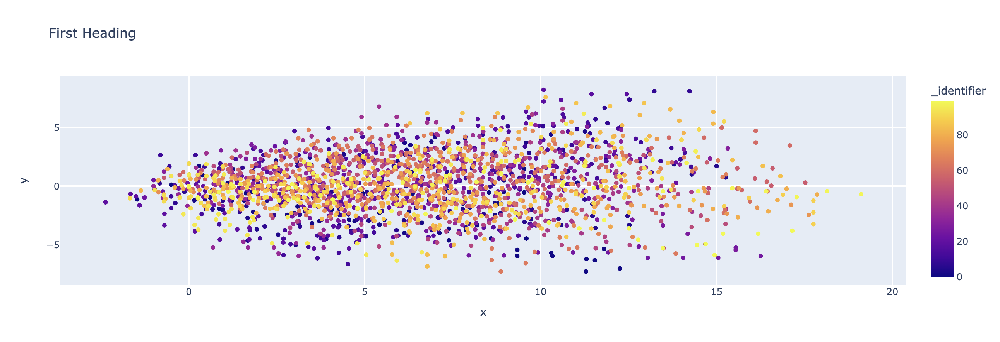

# April 12, 2024

## Changeset

### TL;DR

- Developed a strategy for fitting to higher level data. [Details](#fitting-to-higher-level-data)
- Used that strategy on a super simple model+simulation to see if it even works. [Details](#trying-it-all-out)

### Fitting to Higher Level Data

Last week I noted that while we'd been able to model the satellite tagging data reasonably well it would likely be irresponsible to extrapolate the model given it was learning things that were likely rather local. However this tagging data is not the only 
data we have and so I wondered if we could use other "levels" of data in order to attempt to account for some of these 
issues. 

Specifically I know that there are several studies that have been done of juvenile distributions of Chinook using CWT data. 
While this data obviously does not give us the level of granularity we get from the satellite tagged chinook it should tell 
us something. The problem was what exactly would it tell us and how could I take advantage of it?

Well, consider the following thought experiment. Suppose I take the model as it stands and just assume that it works everywhere.
Then perhaps I look at WA/OR juveniles from some CWT analysis. Specifically suppose that data tells me a rough distribution
of juveniles in a specific area at approximately one year of age (I'm making this up). Well I'd assume that if we took our model
and simulated that same distribution we'd get something quite different. Maybe juveniles typically tend to travel up north west
whereas our adults were traveling south east. So while the CWT data (once again imaginary) might show us a north west tendancy, the simulated data would show all the juveniles going south. 

This is a difference I think we can use. 

What's cool is that our simulation is stochastic. Which means that each fish is not a perfect rendition of the utility function. 
Some fish will go directly south east, some will perhaps go just south, others will have more northerly tendencies. And we can 
take advantage of this spread in behavior. 

Remember that the way we built the utility function in the first place was to simply take an arbitrary utility function, model 
with it, and then adjust it given how well it lined up with decisions we know have been made. In this case we don't really have
any decisions to work with, but what we do have are the results of those decisions. And therefore, in some sense, we also know
which of our modelled fish are behaving more or less like the actual fish we are trying to model. Those that happened to have a
more northern direction obviously are more like the juveniles than the ones that go straight south. And we don't even have to be talking about direction here. Maybe those fish that happen to travel a bit more slowly, or spend more time foraging, are acting more like the juveniles. The point is that because they are closer to the real distribution (as measured by our imaginary CWT study) they are making choices that are closer to how the juveniles do. 

So what if we decided to take their choices *as* the decisions that we'll update our utility data with? Specifically we can always
take our simulated data, treat it as real, and train a new utility model off of it. All we need to train a utility model are
decisions and the simulation gives us just that. So, if we rank our simulated individuals by how similar they are to our juveniles and then overrepresent the decisions of the ones that are more similar we'd train a new utility model that, in theory, will be closer to the ones our juveniles are using. Then we can simulate with this new model, find the individuals that are close again, and repeat until we're matching the juvenile distribution as closely as we can. 

In other words what we want is an algorithm like the following:

The key here is how to rank individuals.

### Basic Ranking Function

What we want is to pick individuals that are similar to our juvenile distribution... yet a distribution is not about single individuals. For example just because we find a simulated individual off in the "wings" of a juvenile distribution doesn't mean that that individual was acting oddly, in fact we need such "atypical" individuals to accurately match the distribution we see in reality. Therefore this isn't so much about where any specific individual is, it's about how the individuals distribute themselves... and yet we have to rank singular individuals at the end of the day. So how do we resolve this dichotomy? 

With the notion of representation. First suppose that our two distributions (simulated and real) cover the same region of space but that wherever the real is very dense the simulation is sparse and visa versa. Well we know that our simulation is not representing the distribution well. In fact we know we need more individuals like the ones in the sparse simulated regions and fewer individuals in the dense regions. So we can say that some regions are underrepresented and others are overrepresented. For those that are underrepresented we want to sample them more frequently than the ones that are overrepresented.

$$w_i = \rho_i / p_i$$

where $w_i$ is the weight of individuals falling in region $i$ (at the end of our simulation), $\rho_i$ is the real density in that region, and $p_i$ is the simulated density. 

Note that if we're able to match the distribution all of our $w_i$ will become equal and we'll stop updating our utility function. 

Alright so what about the case where our distributions don't line up in space at all? Obviously our two distributions may not line up simply because the study was bounded and we're simulating (hopefully) real behavior. We're just going to ignore that for the time being (just to get through this simpler example first) and assume that the real study of distribution was exhaustive. In that case our simulated individuals being outside of the real range is not a good thing. 

What we want then is to move the simulated range toward the real one. We can, in theory, do this by preferencing individuals who are closer to the real range over those that are farther away. 

$$w_i = \alpha / (d_i + 1)$$

where $d_i$ is now the distance between the region in question and the observed range. $\alpha$ allows us to drop the "out of range" weights below the weight of our "in range" regions.

### Keeping What We Know

There is one other problem that I've not really mentioned. In the algorithm outlined above we only use the data from our new individuals to train the new model... however this means that we'll drift entirely away from what we got from our satellite tagging data. We definitely don't want to lose what we've already learned. To deal with this we need to hypothesize a feature that distinguishes the behavior observed in the one dataset from the behavior observed in the CWT based study. Then with this feature in tow we can combine the satellite tagging observed decisions with our simulated decisions in the algorithm. I.e. we'll train with both datasets at once in order to keep what we know and expand it to what we don't yet know. 

### Trying it All Out

Alright, so at this point I wanted to figure out whether this idea even works at all - and so I created a really, really simple example to try it out. 

In this case we'll be dealing with the imaginary "blob fish" whose behavior is very simple. There is a preferred heading for any individual blob with the preference for other headings dropping off exponentially. At each time step the blob chooses a heading stochastically based on these preferences and then steps in the direction of the heading. 

So for a bunch of blobs with a preferred heading of 0 degrees we get:

and for 90 degrees we get:

where these both show the full set of 25 steps for each of
100 blobs. 

The question was now, if we train on the first set and consider the other set a different "population" can we learn both by only considering the density estimates of the second set of blobs?

And the answer is absolutely! The following figures show us the densities at step 25, larger circles mean higher density.

At the beginning we can see that we're simulating entirely off of the trained-on 0 degree blobs:

Yellow are the original blobs, blue are the new blobs.

The real density for the blue blobs looks like:

After 5 iterations of the algorithm we get:

So we can see a split has already started happening.

Finally after 10 iterations we've got:

Full separation!

## Up Next

### Bringing in Some Reality

This week was really about asking - at a very basic level is it possible to use multiple kinds of data to build one consolidated behavior model? And yes, at a very basic level it is. But there were several assumptions made here that aren't so realistic.

- What happens when the study area isn't comprehensive and density outside of an area is unknown? 
- What about cases where there was no attempt to be comprehensive even within a limited area (i.e. we're dealing only with fisheries dependent data)
- Here we only dealt with one model, what about when we need to adjust multiple nodes all at once? 

So what I'd like to do next is find a nice, fisheries independent use of CWT data, attempt to use these techniques, and see what happens. 

If that works out we'll dare to use the fisheries dependent data next. One level of complexity/bias at a time. 

### Up Next

- Use a fisheries independent CWT based study to try and fit to a region/group not seen in the satellite tagging data. 

Classes are ramping up as the semester gets into its final weeks so I suspect the next couple of these will be shorter than usual.