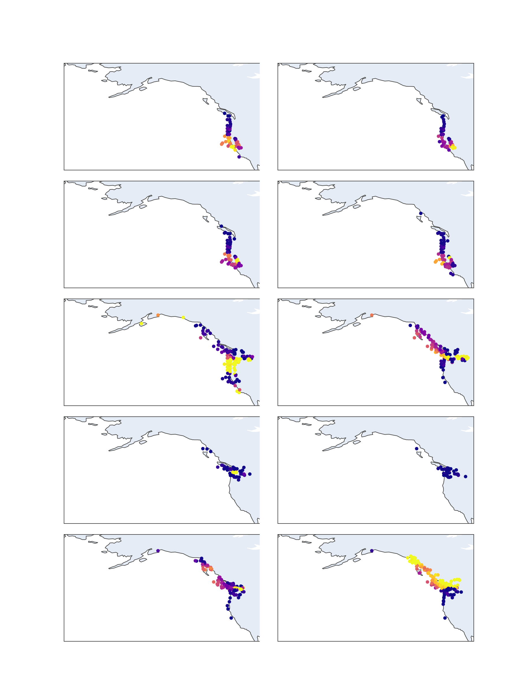
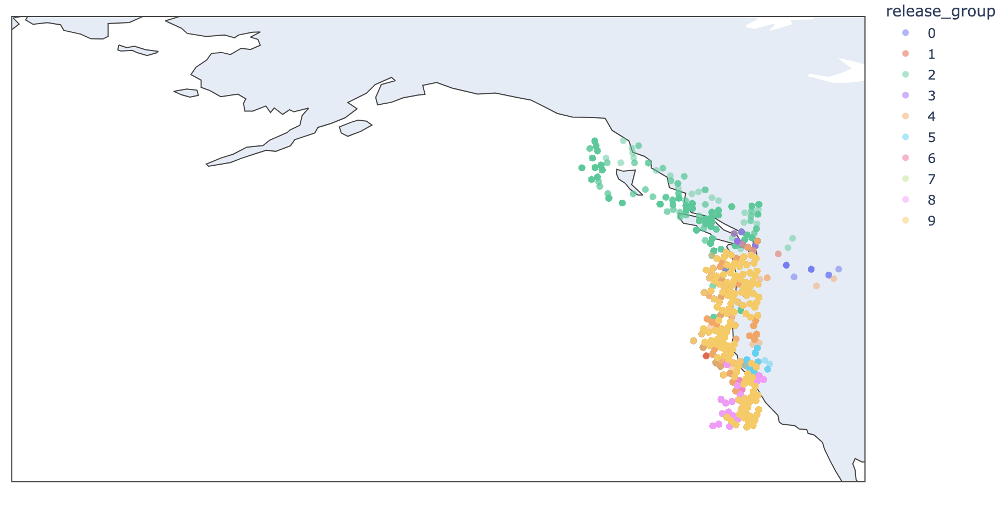

# April 26, 2024

## Changeset

### Getting Started

I ended off last week by noting that the studies I was finding of juvenile ranges was being pulled from rather sparse sets of data. For example the [study](https://afspubs.onlinelibrary.wiley.com/doi/10.1577/T08-181.1) I linked last time came from a series of fisheries independent studies of juvenile distributions conducted over several years that covered a large portion of the coasts of both Alaska and Canada and yet the total number of recoveries they ended up with was <2000. Even if I divided release areas into ten areas and recovery areas into ten areas that's only 20 fish per group! This would make trying to understand relatively precise ranges quite difficult... 

However upon querying RMIS I found that I could collect 10s of thousands of records of year old salmon in just the last decade. Problem is that I don't have any sense of effort that went into any of these records. And furthermore I wasn't sure what to do with all the records in which juveniles weren't found. Do I count those as negatives or do I worry about gear selectivity? 

So task number one was figuring out how I was going to leverage this data at all. 

### Relative Densities

The first thing I figured is that I could get around the selectivity problem by focusing only on retrievals that *did* catch juveniles and ignore any "negatives" in the data. The idea here is that if the gear could catch some degree of juveniles from one
release site, if other juveniles from other release sites were in the area it should've been able to catch an equivalent proportion of them too. 

Second I think it's probably reasonable to assume that within a local enough area the relative densities of different release sites (or origins) would stay constant. So, if I grab all the positive samples within a region each one should be a sample of that relative density. Furthermore, I think that should mean that I can take the sum total of salmon from each origin in that region and compute the relative densities from those totals. I.e. each individual sample is a poor representation of density but the bucket including all samples in the region should be a decent estimate - assuming I grab enough samples. 

All in all then, while I may not have effort or selectivity information, within a region with positive catches I should be able to get a sense of relative densities from different origins.

How would I then use this information? Well first of all the relative density $d_{R, O}$ (where $R$ is a retrieval region and $O$ is an origin region) is related to the total number of juveniles $N_O$ and a distribution density $\rho_{R,O}$ by the following equation:

$$d_{R,O}= \frac{N_O\rho_{R,O}}{\sum_{o}\rho_{R_,o}N_o}$$

i.e. it is the number of fish from region $O$ divided by the number of fish from all regions $\{o\}$. $\rho_{R,O}$ is just the proportion of fish from region $O$ that ended up in region $R$. 

Now suppose I took my model and ran a simulation. At the end of it I'd know for any origin region $O$ what the $\rho_{R,O}$ are. The $N_O$, however, remain unknown. However I also know what the target $d_{R,O}$ is (from the CWT densities described above) and so what I have are a series of unknowns $N_O$ that need to be fit! 

Put another way, I can run my sim for each origin region many times, determine the $\rho_{R,O}$ and then fit the $N_O$ to get as close as I can to the observed $d_{R,O}$. 

Then at that point I'll know how well or poorly fit my model is in terms of $\rho_{R,O}$ and, like in the Fishy Friday from two weeks ago I can pick individuals who are behaving "well" and bump them up in training and drop the weight of individuals who are doing "poorly". After which I'll retrain the model and repeat the whole process until convergence. 

### Choosing Regions

All of this has depended on the notion of regions - areas in which to grab summaries of the data. The first thing then that I wanted to do was come up with an algorithm to choose the "ideal" regions. I tried a couple different clustering algorithms but to no avail - no matter what I did I kept getting super snaky and odd looking regions. 

What I realized is that all a "good" region needs to do is create a stable metric (stable in the sense that it's statistically significant in its difference from other areas) using adjacent regions - and because the most powerful way to create significance is to just gobble up more data that's all any of the algorithms would do - they'd just grab the biggest handful they could find nearby and before long they'd have a statistically significant result even if the regions were clearly unrelated to anything real... I feel like there's a statistics lesson in there somewhere :) 

Anyways after much head scratching and frustration I realized I didn't actually need distinct regions. All the math I described above works if the release regions actually overlap. So what I decided to do for them was to just pick an H3 cell (a gridding system I described in a fishy friday a while back) and then just keep pulling in that H3 cell's neighbors until I had enough data that my relative density vector (basically a list of densities for each $O$) became stable enough under bootstrapping. 

Then I could do this for each H3 cell that showed up in the data to get a whole bunch of regions. 

For releases I decided to just bin the data by latitude where I chose the bins such that I had an even number of data points per region. 

This is what the result looks like:

Each panel is a different origin $O$ from the lowest latitude in the data I pulled to the highest. Each dot is a retrieval H3 cell (so a $R$) and the color indicates the density (yellow is high, blue is low).

Pretty neat stuff. 

### Simulation Time

Alright so the next step was to simulate the same. And here I ran into trouble yet again. 

I started by simulating 10 individuals for each of the ten regions. The following shows the full timeline from one run of the sim:

And it's not horrible but clearly needs tuning (as we would expect as that's the whole reason we're going down this long chain of thought). But the real problem is that simulating those 100 individuals takes around 5 minutes. 

At first this doesn't seem so bad. We were simulating 365 steps across 100 individuals and 5 minutes * 6 processes / 36,500 steps is around 40 milliseconds a step. 

The real problem is when we think about the scale this is going to have to work at. We'll need to probably run more like 1,000-10,000 individuals which will turn into 50 minutes to 8 hours just for sim! And then we'll need to run this many times over as we'll be simulating, then tuning, then simulating, then tuning, and so on until convergence. 

In otherwords one fit could take days!

Now in part I was anticipating this a while back (before the fishy friday's unfortunately) when I developed an idea for an architecture that would allow me to spin up loads of simulators in cloud, keep passing information between with caches, and thereby get as much parallelism as I possible could. 

But while I know that'll eventually become a necessity this just seemed way too soon. So I asked myself - I am overcomplicating things??? And I think the answer is probably yes. 

### Keep it Simple, Stupid

This I went ahead and added straight to the `mirrorverse` wiki - [Blake, The Fish Aren't Real](https://github.com/networkearth/mirrorverse/wiki/The-Theory#blake-the-fish-arent-real)

Short story is that simulating every single day when all I really care about right now is a month by month level means I'm probably wasting 11/12ths or ~90% of my compute/time. By dropping to a month by month resolution I should be able to optimize this stuff in a few hours instead of a few days. 

So it's time to go back and model the individual "diffusers" at the month level and then revisit this problem. 

### Some Updates to the Program

Wanted to make sure I got some time in fleshing out the program details a bit so I made an update to the overall system design and more or less rewrote this page - [The Thing Itself](https://github.com/networkearth/mirrorverse/wiki/The-Thing-Itself)

## Up Next

Given I need the higher level model I'm going to step back and build it - https://github.com/networkearth/mirrorverse/issues/40

I also plan on finishing up this ticket by putting more detail into the Stakeholders section of the wiki - https://github.com/networkearth/mirrorverse/issues/36

If the modeling effort goes quickly I'll pivot back to the CWT integration. 

Cheers!
