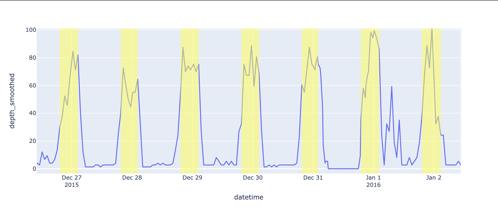
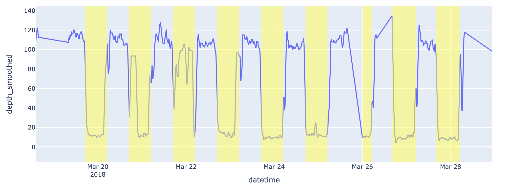
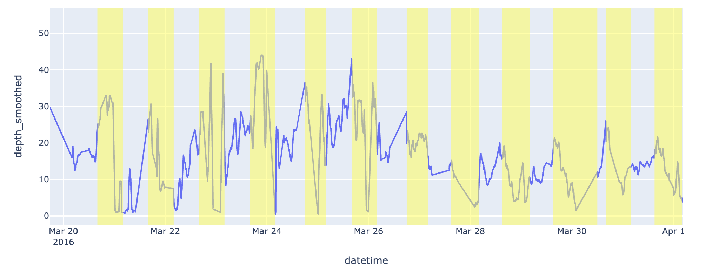

# May 10, 2024

## Changeset

- Already mentioned in the email chain, but put together a small study that demonstrates one can do a useful form of stratification using odds modeling - [Stratification with Preference Modeling](https://github.com/networkearth/mirrorverse/wiki/The-Theory#stratification-with-preference-modeling)
- Decided to focus on depth data first so I got that added to my local "warehouse" - [Added Depth Data](https://github.com/networkearth/mirrorverse/pull/44)
- Started doing some exploratory data analysis with the depth data (see the following section)

### Depth EDA

The first and most obvious pattern in the data is a clear diel pattern like the following:

where the yellow sections are daytime (sunrise to sunset). 

This one is pretty cool because in many cases it seems to follow what you'd expect from a fish hunting the deep scattering layer. In this example the fish is in relatively shallow water and so the dives are not as extensive but for fish way out at sea the dives often go down to where the deep scattering layer is generally known to be. 

Not all fish exhibit this pattern. In a sample of 25 fish that I manually inspected I found that ~44% exhibited this pattern at least part of the time whereas around 52% just seemed to change depth at random (something I'm still examining). 

There were a very small number of fish who exhibited the opposite pattern:

where dives happen during the night rather than during the day. Not entirely sure what's going on here and would love to hear any guesses. :) 

An example of the "random" diving that seems to constitute the majority of the time and fish is:

My human brain wants to see patterns in this but I'm still not sure which patterns are real. 

A couple other hints have come out of my EDA so far:

1. There seems to be a lot of similarity between fish tagged in similar places (i.e. similar tag id's show similar diving behavior generally speaking)
2. There are many cases where the "random" behavior is within a relatively small depth range, so I'm wondering if it looks random simply because we're only seeing the noise present in the more dramatic diving cases, just without the dives.
3. I have a suspicion that the depth window for each fish is being defined by the local bathymetry but I've yet to hammer that into more than a suspicion. 

## Up Next

1. I'd like to sort out whether I can reasonably do some "smoothing" of the data to distinguish between random "small" movements and more general depth change patterns.
2. I'd also like to see whether some of this seemingly random stuff is in fact not random at all. I started playing around with fourier transforms and there are some interesting things popping up (but so far it's all just single cases).

Where I'd like to end up is with a distinct set of behaviors that I can classify and then model distinctly. Then my behavior model tree will be a series of branches for each type of behavior and a root node for switching between those behaviors. Just as we did for the "in plane" movement model.
