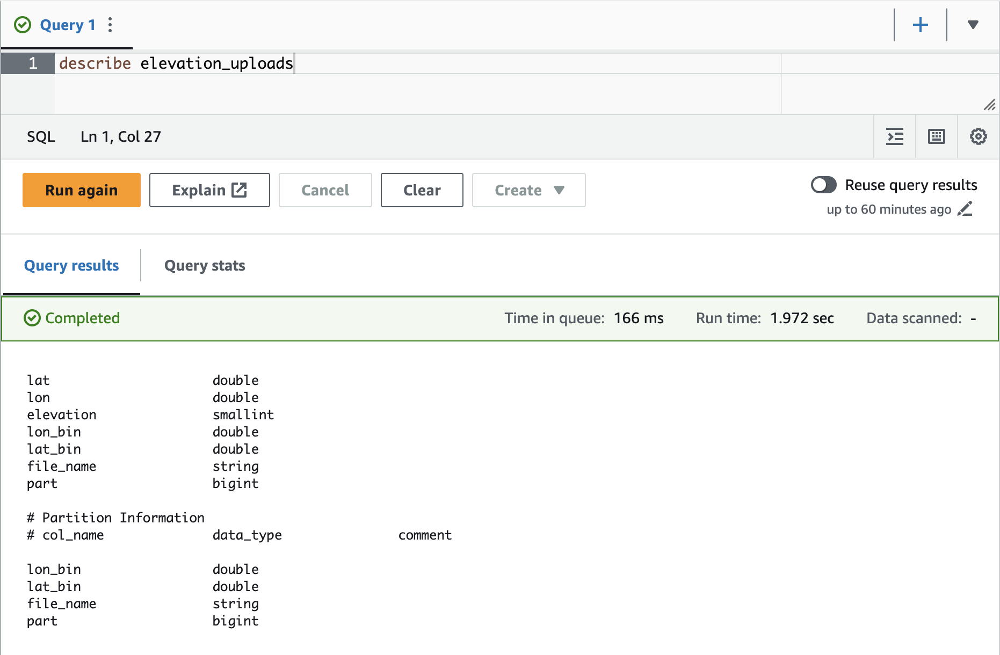
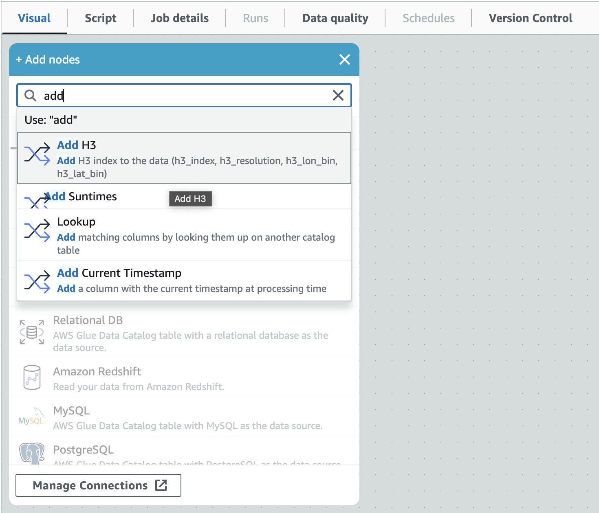
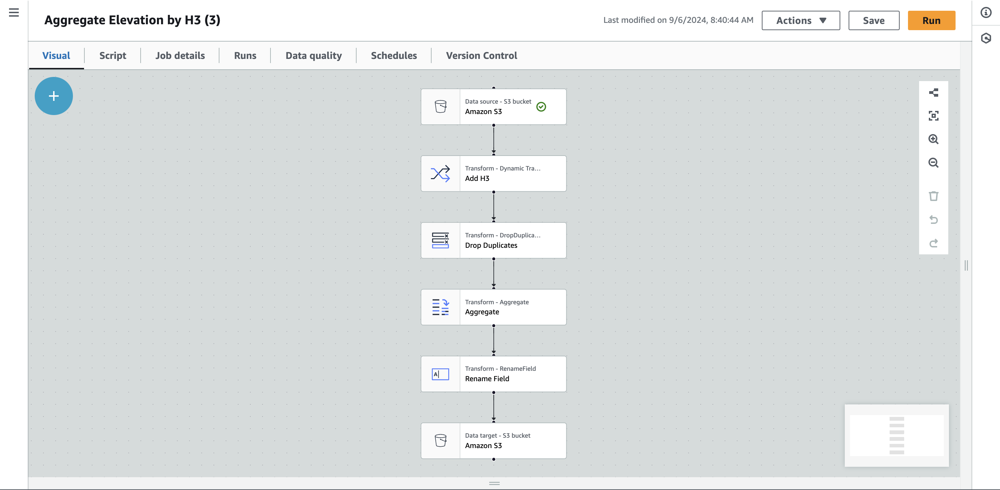
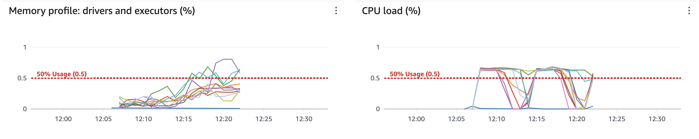
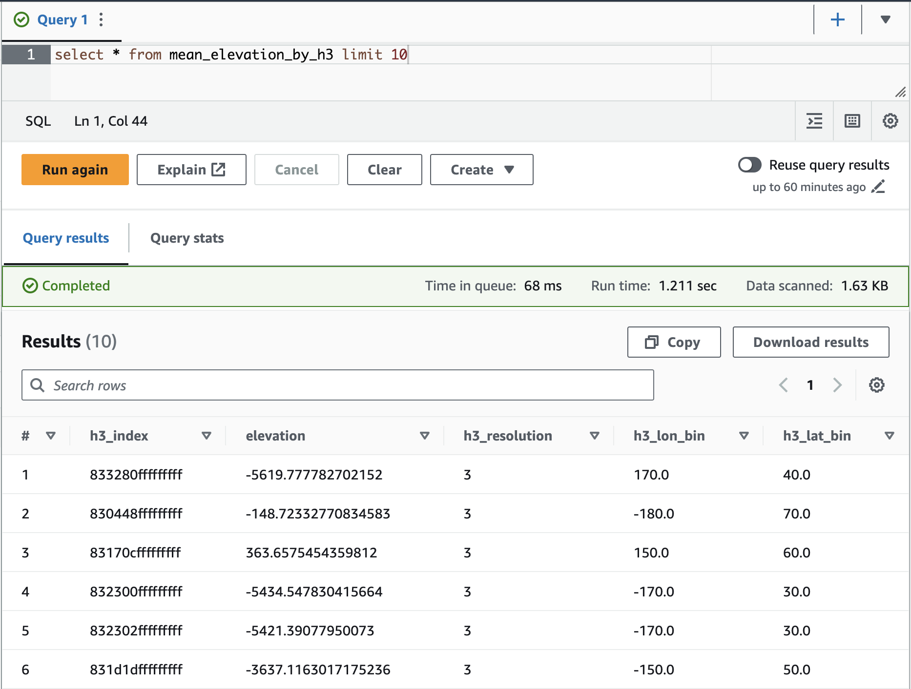

# September 6, 2024

## Changeset 

### I Am Speed!

One distinct problem I ran into during the summer was data volume. Specifically I was finding that my datamanagement, model
training, model inference, and data exploration "jobs" were starting to take an unproductive amount of time. Before 
parallelizing my ETLs (extract transfer load) functions, just building feature sets was taking a few hours. I ended up using
PySpark to parallelize this and bring it down to a quantity measured in minutes. While this was a big step forward, as the data I was operating on got larger and larger I knew that eventually I was going to need to distribute this stuff across multiple machines. So, given the switch to put data in AWS Athena I decided now would be a good time to make the switch to using a cloud
based PySpark solution. 

After some research it became clear that I had two options - AWS Elastic Map Reduce (EMR) and AWS Glue. The latter fully manages
your spark cluster for you, spinning it up and down as needed (and even allowing for automatic resizing), and given the wonders
of all things serverless I decided to give it a go. (Also the price point is great at 44 cents per hour of compute time)

#### A Little Background

Alright, so what is Spark and what is Glue really? Back in the burgeoning days of big data the strategy was simple, if you ran out
of compute just get a bigger machine! Eventually however it became clear that the rate at which data was being gathered was
outpacing the rate at which bigger and better machines were being made. So folks started playing around with ways to use many
computers in tandem. Out of this was born a particular strategy - Map-Reduce - that took the big data world by storm and more or less
exists as _the_ paradigm to this day. Initially Map-Reduce found its implementation in Apache Hadoop which worked mostly 
by using tons and tons of disk space to allow for large jobs to be run. But as memory (RAM) became cheaper and cheaper Spark - Hadoop that operates in memory - was born. Obviously just keeping everything in memory solves IO bottleneck issues and so 
Spark was considerably faster than Hadoop. Anyways loads of other frameworks have come and gone but at this point, no matter
where you look, if someone is doing large Map-Reduce jobs they're probably using Spark. 

So what does Spark look like in practice? Well given it is a Map-Reduce framework, Spark is a platform for running Map-Reduce jobs
and Map-Reduce jobs are basically a directed acyclic graph of either Map or Reduce functions where map functions operate on
single rows of data and reduce functions aggregate data. So think of Spark as a way of running chains of data manipulation tasks.

The power of Spark comes in the fact that while you write the job as one string of data operations, Spark then takes those 
and sorts out how to efficiently run those operations across as large a cluster as you like. And because it does it all in memory
it is very, very fast. I've built Spark-like jobs that on a single machine take days and then can be spun up on a cluster of 
1000's of machines and take minutes. 

The one problem with using Spark is that in order to use its power you need a cluster and clusters are hard to build, configure,
and maintain - not to mention costly. Enter the cloud!

What AWS Glue offers is a fully managed cluster for you to run your Spark jobs on. It falls under one of these "serverless" 
offerings in AWS. That means that the cluster is only spun up when you run a job, rescales itself (if you enable it to), and spins down immediately once your job is complete. All you have to do is provide the job definition and Glue runs it for you
and then charges you only for the compute you actually used. And what's especially cool is the charge is per hour of DPU 
(data processing unit). So if a job takes 10 hours on one DPU and therefore costs you $4.40, if you parallelize it across 
100 DPUs and it takes 6 minutes you'll still only be charged $4.40. So, up to the parallelization of your jobs, you can make your
data workflows as fast as you like without getting charged extra. Pretty awesome!

But Glue brings even more than this. It allows you to define custom transforms (snippets of code) which then show up in a visual
editor so that someone without, say, a Python background can visually string together data transforms of their own. This 
coupled with Athena means non-coders can come in and play around with the data to their hearts content and get the full power of 
Spark while doing it! 

Clearly pretty awesome, so I wanted to see what it actually takes to get all this setup and did so using the elevation dataset
I've been playing around with.

#### Putting Glue Into Practice

1. **Uploading Raw Data to Athena**

This step is super easy using the [`haven`](https://github.com/networkearth/haven/tree/main) library mentioned in the last fishy friday. I just opened
the `.nc` file I had downloaded from [GEBCO](https://www.gebco.net/data_and_products/gridded_bathymetry_data/) and uploaded it straight to Athena. 



Now this data is far to granular for our use case (there are hundreds of 
millions of records) so I need to bin it by H3 grid cells and produce a 
cleaned up dataset that can be joined to our fish paths. Glue doesn't
come with it's own H3 binner so we'll need to make that ourselves. 

But to do that we'll need a place to test new transforms without actually
calling Glue and spending money. 

2. **Setting up a Local Environment for Testing**

For this I just created a docker image with every you need for local testing
installed and dropped that in a new repo - [metamorph](https://github.com/networkearth/metamorph). 

3. **Creating and Testing our Custom Transformation**

The transformation itself is super simple code:

```python
import h3

from awsglue import DynamicFrame

def add_h3_for_record(row, resolution):
    row['h3_index'] = h3.geo_to_h3(row['lat'], row['lon'], resolution)
    lat, lon = h3.h3_to_geo(row['h3_index'])
    row['h3_lat_bin'] = (lat // 10) * 10
    row['h3_lon_bin'] = (lon // 10) * 10
    row['h3_resolution'] = resolution
    return row

def add_h3(self, resolution):
    resolution = int(resolution.strip())
    return self.map(f = lambda r: add_h3_for_record(r, resolution))

DynamicFrame.add_h3 = add_h3
```

and the test is just as simple:

```python
from metamorph.glue import build_glue, read_sample_data
from awsglue import DynamicFrame

import transforms.add_h3 as add_h3

if __name__ == '__main__':
    data_sample = [
        {"lon": 10, "lat": 10, "epoch": 300},
        {"lon": 45, "lat": 56, "epoch": 600},
    ]

    context, job = build_glue()
    df = read_sample_data(data_sample, context)

    df = df.add_h3(resolution='4')

    df.show()

    job.commit()
```

4. **Uploading to Glue**

Here I built some CDK and deployed the bucket required and then uploaded the 
transform along with a small config:

```json
{
    "name": "add_h3",
    "displayName": "Add H3",
    "functionName": "add_h3",
    "description": "Add H3 index to the data (h3_index, h3_resolution, h3_lon_bin, h3_lat_bin)",
    "parameters": [
        {
            "name": "resolution",
            "displayName": "Resolution",
            "type": "str",
            "description": "H3 resolution to use"
        }
    ]
}
```

And bingo it shows up in the visual editor!



5. **Creating our Data Pipeline**

Then I just strung together a source (where to load the data from), 
some transforms, and a target (where to load the data to) using the point
and click UI in AWS Glue Studio. 



The pipeline picks up the data we just loaded into Athena and writes the
cleaned data right back to Athena. 

5. **Run It!**

You can see the big orange run button in the corner... I just hit that :D 

Then you can go checkout the metrics as the job is running:



Pretty sweet!

6. **Check Out the Results**

So first, this job took 2.83 DPU hours but because I had run it across 10 
machines it only took 17 minutes of my time! That's a huge bump in 
productivity for me. And it only cost me a buck fifty. 

But just as importantly all the data is now up in Athena! So anyone with
access to the database can use it now too! And if anyone wants to use my 
H3 binning transform in their pipeline it's literally just a click 
away. Pretty nifty. 



## Next Steps

- I'm going to get the rest of my data using Athena and Glue now that I've 
got a handle on them both
- @Michael I'd love to either show you how to use this stuff or get my hands
on the scripts you've coded up for turning raw tag data into cleaned tag data
so that we can just Glue-ify them and make loading things into the database 
that much easier. 
- Once my data is up I'm onto another time-sync from the summer - Hyperparameter 
tuning of my neural networks. My overall goal here is to reduce my development
iteration cycle so that I can actually be productive while being in class and working
on research at the same time. :) 


