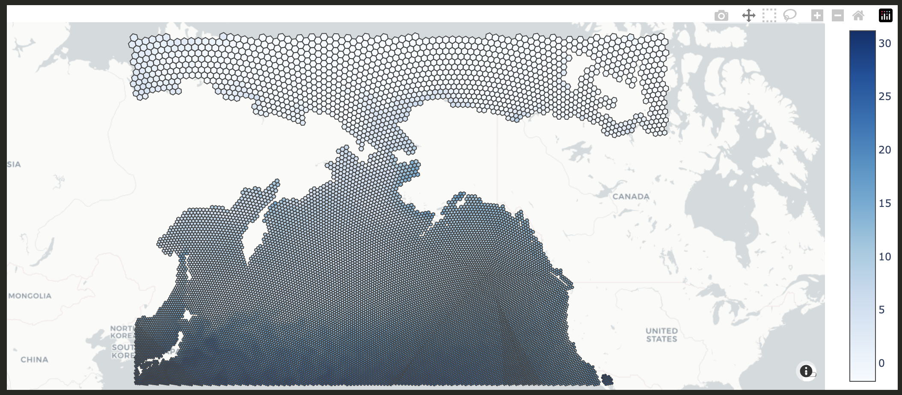

# October 11, 2024

## Changeset

- Sorted out the rest of the issues in downloading data from Copernicus Marine Service. For more details feel free
to check out this [README](https://github.com/networkearth/mirrorverse/blob/4ec2e8094c2f714d6ee5d7c429d38a2362192a6e/data/copernicus/README.md).
- We will end up with a whole load of features such as salinity, temperature, water movement, nutrient concentrations, primary productivity, and more for each day from 2013-2022 at an h3 level 4 resolution across all the depth classes we've been using thus far. The following image gives you a sense of the
data we'll be working with:

This is sea surface temperatures by h3 cell for July 1, 2022. 

## Up Next

Still running some of the scripts to get the data up into Athena, but by Monday I should be in a position to start modeling again! 