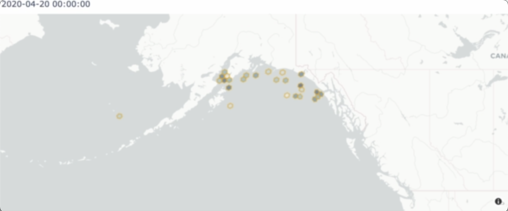
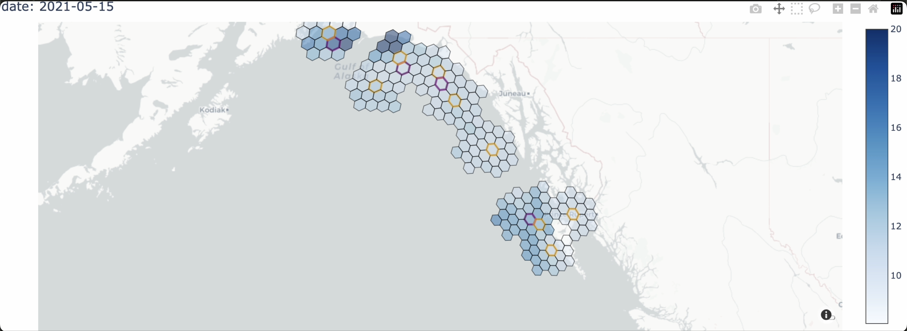
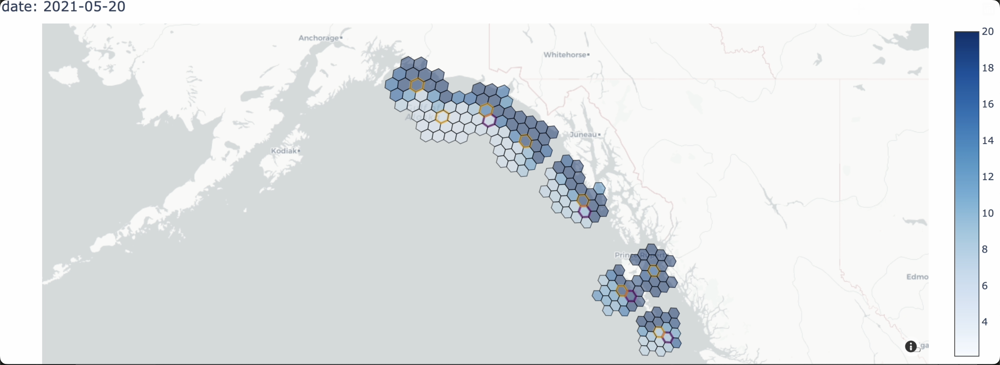
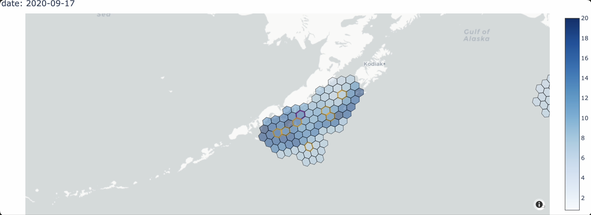
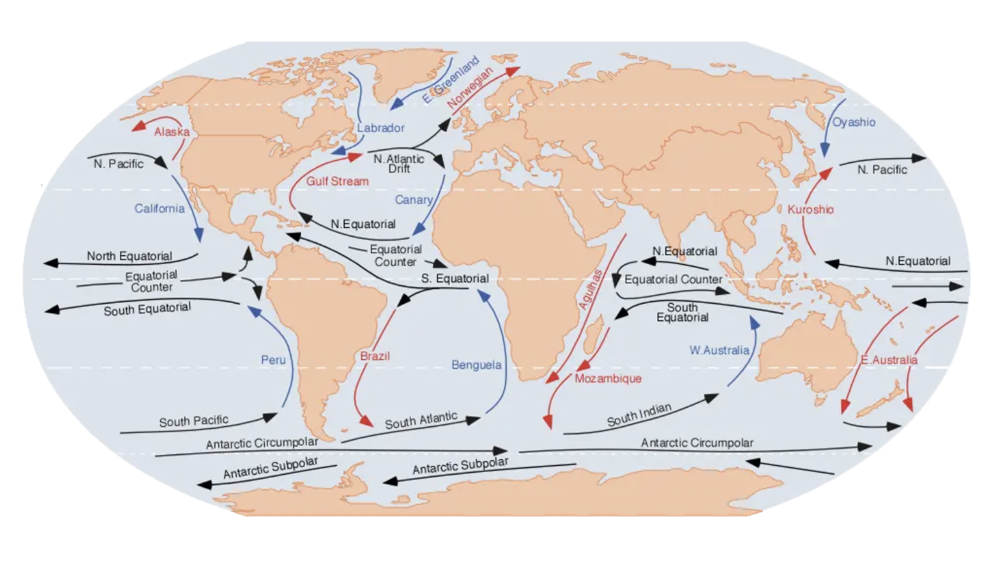

# October 18, 2024

Got to start looking at the tagging data with these new features in hand! 

First of all I found it much more helpful this time around to look at fish in groups (otherwise
my brain sees patterns in the individuals that don't really exist overall) so let's start with
all the fish put together in a single year!

This is a screenshot from the following animation - [common time animation](https://github.com/networkearth/mirrorverse/blob/main/docs/fishy_friday/2024_10_18/common_time_swim.mov)

I've watched that over a dozen times now and a few things jump out to me. 

1. Most fish up north just sort of wander about near wherever they were caught to such an extent it's almost like there are distinct "villages" of fish. 
2. Those along the southern coast of alaska move up
and down the coast quite a bit. And those by the big 
glaciers all seem to move together at around the same time. 
3. Those in the EBS just wander all over the place. 
4. Almost no fish swim off the continental shelf. 

These observations made me decide to split things up by area and tackle 'em one at a time starting with the fish near the glaciers as they are the most dynamic of the lot. 

I went through quite a few different features hoping to sort out why they all just pop off at the same time until I stumbled across mixed layer depth which brings us to our [next animation](https://github.com/networkearth/mirrorverse/blob/main/docs/fishy_friday/2024_10_18/mixed_layer_madness.mov). 

In this animation we see the mixed layer thickness (where 20 just means it's $>=20$) as well as the current positions of the fish (orange) and where they are going to go in the next step (purple). What's crazy is that once the mixed layer thickness drops to its minimum the fish start moving out of the region and down south. I've checked a couple of other 
areas and what you find is the fish wander about until the mixed layer 
drops away and then start behaving much more "frantically" than before when they were just sort of hanging out. 

Having a sneaking suspicion this had something to do with food I decided to look at the net primary productivity as well. 

In [this animation](https://github.com/networkearth/mirrorverse/blob/main/docs/fishy_friday/2024_10_18/production.mov) (where the cap is 20 again) you can see that once the 
fish start moving out they hug where the primary productivity is. 

Here in [this animation](https://github.com/networkearth/mirrorverse/blob/main/docs/fishy_friday/2024_10_18/primary_aleutians.mov) we also see what looks like spatial correlation between the fish and the primary production:

It felt, at this point, that I had a pretty reasonable hypothesis to start with except for one problem - I didn't have anything explaining why the majority of the fish go south east when they really start to move. However I'm wondering if the prevailing currents are responsible for this, perhaps if you're a salmon you want to swim into the stream of food when you're moving around a lot to forage. 

Something like this:

*https://earthhow.com/ocean-currents/*

So here's the present idea - our salmon's behavior is more or less a pseudo-random walk driven by getting food. Therefore I'm going to build 
a model where the features are:

- `net_primary_productivity`
- `elevation`
- `mixed_layer_thickness`
- `velocity_north` and `velocity_east`
- `distance`

And we'll see how far these features get us and use the resulting model 
to sort out what else we may be missing. 

