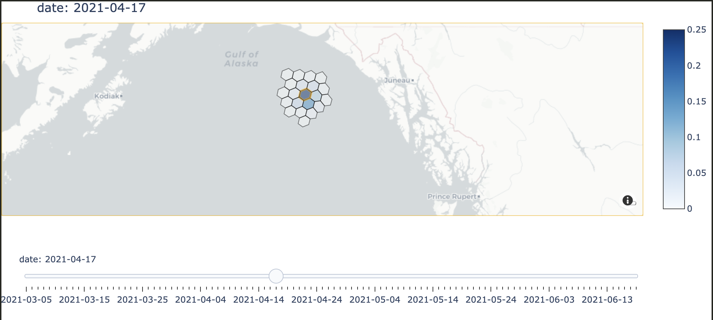
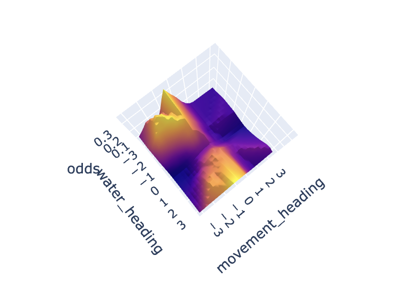
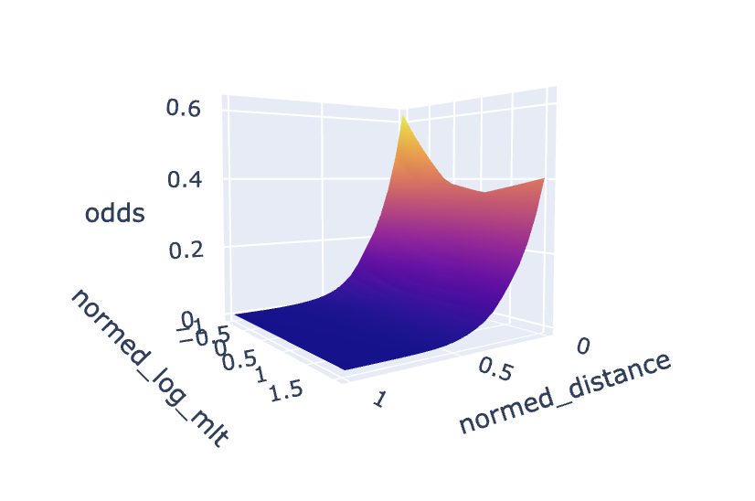

# October 25, 2024

## Changeset

### Contrasts

So as per the next steps from last week I ended up building out the features required to build a model with the
following features:

- `net_primary_productivity`
- `mixed_layer_thickness`
- `distance` (from current position)
- `water_heading`
- `movement_heading` (from current position)

(I left `elevation` out out of curiousity for whether it is actually needed). 

After evaluating how many choices were available to each fish at each decision I ended up with a distribution ranging
from 7 choices to a median of 19 choices and a maximum of 32 choices. So, the `max_choices` thrown at mimic ended up 
being 32. And then I got the results back that the model was absolutely terrible. It did get anywhere beyond 
a 1/32nd chance of being right (which is what would be expected if we were making random guesses). This was confusing given the fact that ~65% of the time fish just stay were they are so even a model that just put 
a high value on `distance=0` and a low value on everything else would do pretty well. Clearly there was some kind of 
bug. 

The bug, as it turns out, was simply class imbalance. Given the fact that I'm not actually training a classifier but 
instead a log-odds value model, my 32 classes really end up being 31 cases where the log-odds should be near 0 and 
1 case where it shouldn't. Therefore the model does "well" by just always predicting very low log-odds and doesn't ever
learn anything. 

At first this was a bit frightening but then I realized that because I'm training a value model I don't actually need 
to keep the decisions fully intact. Even if I consider just pairs of choices from a specific decision the values assigned
to those choices still need to be able to work and therefore those pairs remain useful training data points. All that's
required is that I'm careful about how I sample pairs so I don't tip the training data towards decisions that have lots
of choices and wash out those with few choices. I.e. I need to the same number of samples from each decision and the same
number of decisions from each individual. And then these pairs of choices mean that I have a balance of 1's and 0's in 
my classes. 

As such, I went ahead and built a new component in `mimic` that allows you to build contrasts from normal decisions and 
choices data - [Changes](https://github.com/networkearth/mimic/pull/1).

The other thing I included in that PR is the ability to get the direct log-odds out of the model as the actual
probabilities in the pairs only matter for training and hold little value otherwise. 

With all of this in play I was able to retrain the model and it actually learned things!

### What the Model Learned

So first it seems that the model did in fact (at least superficially) learn the pattern of fish moving south after the mixed layer thickness drops south of Anchorage. The following image shows an example of this. The colors are now the probability of movement (according to the model) as this is taken the day the mixed layer thickness drops. You can see that southerly hex lighting up whereas on previous days there was no directional bias. 

I wanted to figure out exactly why this was happening so I build a little app that allows me to inspect the 
actual function the model has built out itself. Here is an example:

This image shows the relationship between `odds`, `water_heading`, and `movement_heading` when the choice results in a move from its current position 
and the `mixed_layer_thickness` is low and the `net_primary_productivity` is a "medium" level. What's 
interesting here is you see spikes for specific movement headings that happen to correspond to a south-easterly direction. And as the `net_primary_productivity` goes up that bias to south easterly goes up as the `odds` of those spikes go up as well. 

If the `mixed_layer_thickness` increases this pure south-easterly pattern gives up the ghost. 

The relationship to distance is also what you'd expect, as seen in the following image:

with staying in place being the most likely option (at least as per the odds seen here).

There are however some weird patterns:
- anticorrelations with mixed layer thickness or net primary productivity in certain cases
- southerly tendancies even around the aleutians where the real data shows no such thing
- no large differences in activity levels between fish

However its hard to say if the above are issues as its become clear that the odds can really only be interpreted in situ - they don't make any real sense until placed together as a series of choices. So I'm going to build out a sim to take this model and actually track the decisions it would make (rather than just looking at how its evaluating the decisions real fish have made). I think this will be a very useful tool for finding patterns (and anti-patterns) in the model. 

### A Final Observation

One last point is that the model actually allows you to rank individual fish by their ability to be modeled by the features in question. This has turned out to be super useful as just looking at the fish that aren't modeled well versus the ones that are makes it pretty immediately clear what the next behaviors to model need to be. For example in this case the fish that are modeled poorly are the more active ones whereas the ones modeled well are less active. So we need to find some feature that will better modify the value associated with staying in place. 

## Up Next

Build a simulation to get a better sense of what this model is really learning.