# December 20, 2024

## Headlines

- Our models are doing a good job of learning how fish move and not just the rate at which they "stay put"
- Overall the model is 5x better than random on GMP! And it's 3-4x better on decisions that involve moving. 
- Added actual training loss and configurable optimizers to `mimic` - [Pull Request](https://github.com/networkearth/mimic/pull/2)
- I was using way too small a batch size to get realistic probabilities but somehow that didn't show up in the scoring. 
- Found that in the end learning rates matter quite a bit and dropout was unnecessary (at least for these models). 
- I have results for three different models that I can use to explain how to dive in and interpret and diagnose these models. 
- Started writing up a whitepaper on all of this stuff. 

## Next Steps

- Use the three models to show how to go about digging in, diagnosing, and interpreting log-odds models.
- Use those results to fill out the rest of the white paper. 

## Notes from the Week

Using [this article](https://towardsdatascience.com/designing-your-neural-networks-a5e4617027ed) as inspiration. 

### Drop Out

#### Basic Test

The main problem I was having at the end of last week was overfitting. As I was adding more and more features I was having to make the net smaller and smaller in order to avoid it. Drop out is specifically designed to help avoid this. 

I went ahead and trained a series of models all three layers deep of varying layer size (8, 16, 24, 32) and with varying levels of dropout (0%, 10%, 20%, 30%). The features incorporated were `normed_distance`, `movement_heading`, `normed_log_mlt`, `normed_log_npp`, `cos_time`, `sin_time` - a combination that had been giving me overfitting troubles before. (Version 3.3.12)

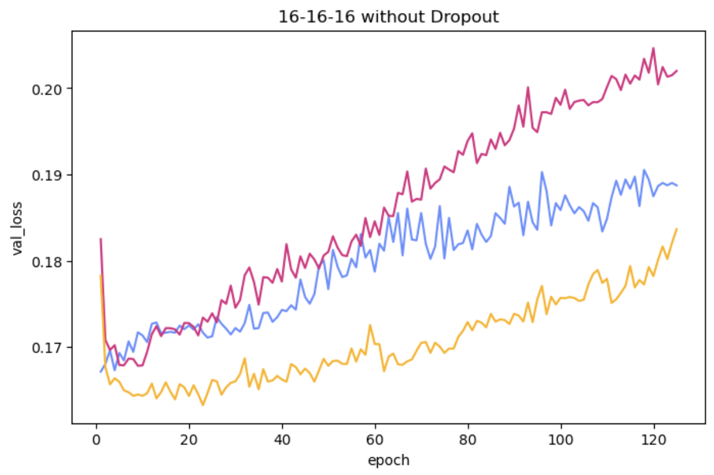

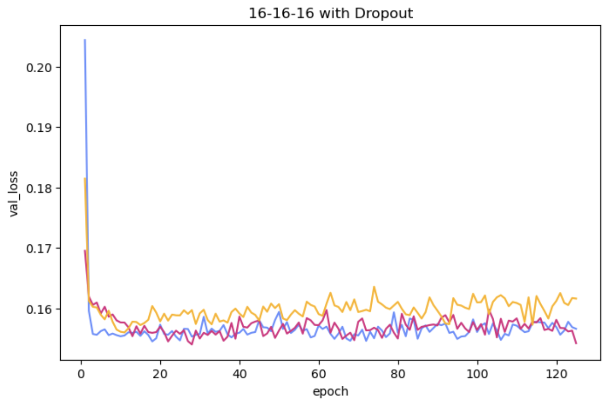

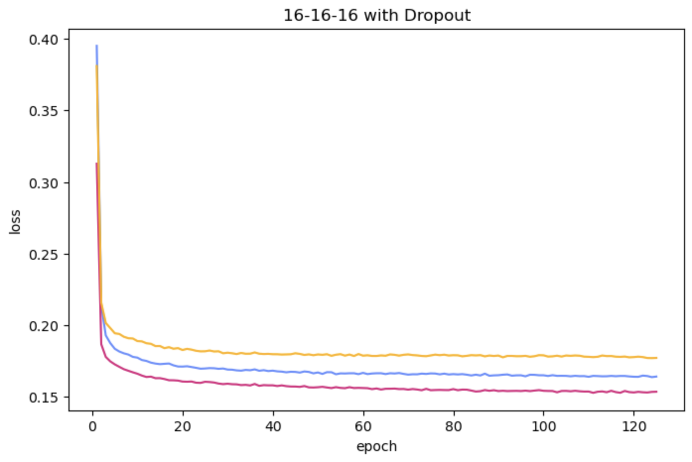

Dropout takes care of the problem for us!

With the dropout at 30% it even works for 32-32-32 and gives us the lowest validation loss we've seen yet (at least briefly)!

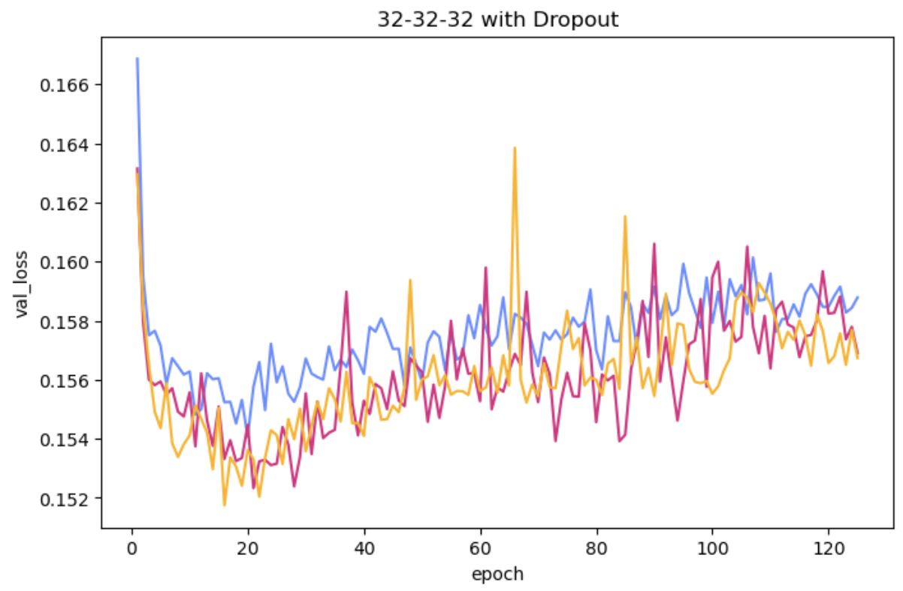

This is fantastic as it'll allow us to focus on the other hyperparameters rather than trying to find the perfect network size. 

#### All the Features? 

Given this is helping us this much, can we go ahead and just throw all the features into the same pot? 

We'll run through:

| Hyperparameter | Options |
| --- | --- |
| Epochs | 50 |
| Batch Size | 500 |
| Neurons per Layer | 24, 32, 48 |
| Layers | 3 |
| Dropout % | 20, 30, 40 |

| Model | Val Loss | Loss | Features |
| --- | --- | --- | --- |
| 3.3.13 | 0.158 | 0.166 | "normed_distance", "movement_heading", "normalized_fork_length", "normed_home_lat", "normed_home_lon", "cos_time", "sin_time", "normed_log_mlt", "normed_log_npp" |
| 3.3.14 | 0.152 | 0.175 | "normed_distance", "movement_heading", "normed_log_mlt", "normed_log_npp" |

From this alone it looks like there's some overfitting still going on with all of these features. 

The best from 3.3.14

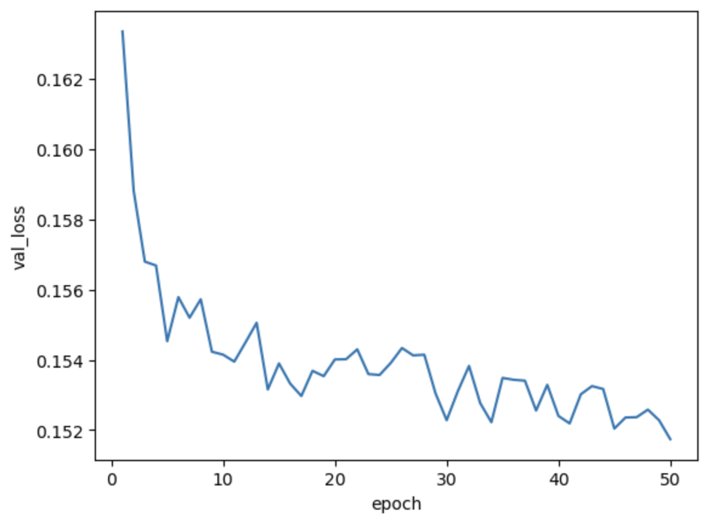

Looks like it was still learning! (24-24-24, dropout 30%)

Looking at the best from 3.3.13

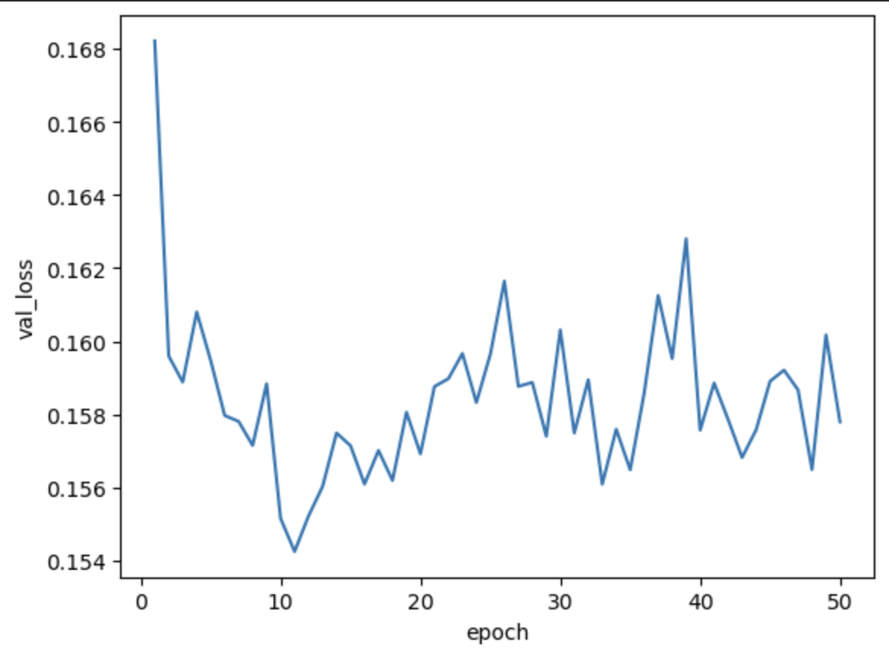

it doesn't necessarily seem like standard overfitting is happening here... more that it's having trouble learning the same generalizable pattern as above. Also interesting this "best" had the same architecture as the best from 3.3.14 which makes me wonder if the 32 and 48 archs were themselves overfitting... 

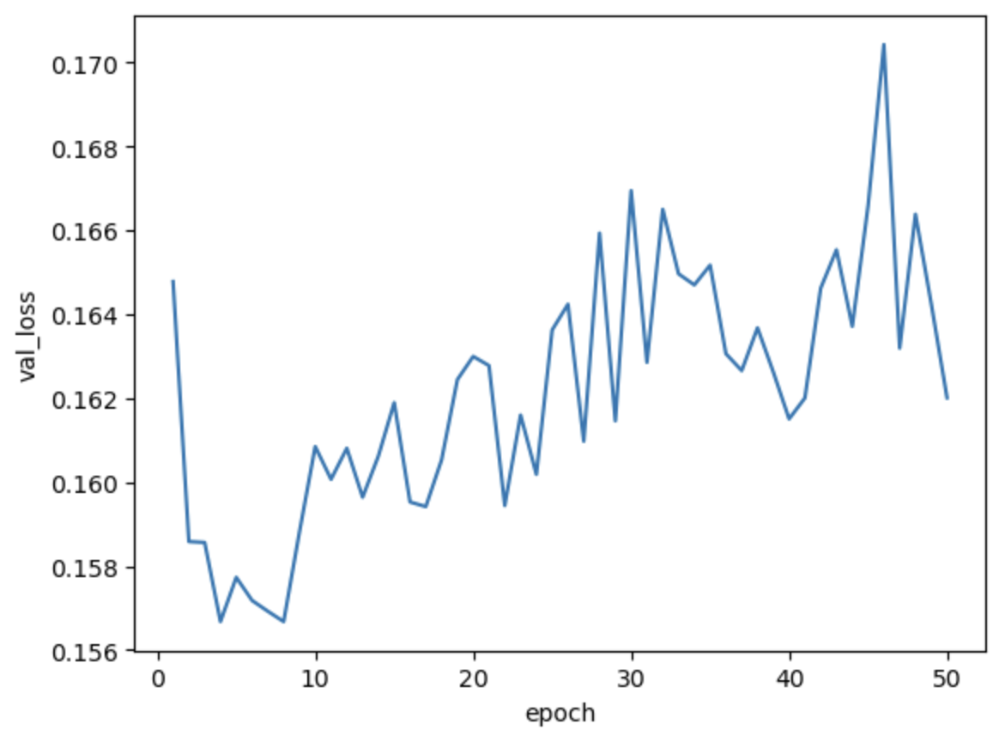

That is the best version of the 48-48-48's... and yea that's definitely overfitting. Let's get more aggressive with the dropout. 

| Hyperparameter | Options |
| --- | --- |
| Epochs | 50 |
| Batch Size | 500 |
| Neurons per Layer | 32, 48 |
| Layers | 3 |
| Dropout % | 30, 40, 50, 60 |

My best validation loss here was a 0.16 and the graphs show that the overfitting issue has been addressed. However there doesn't seem to be an advantage in terms of performance as compared to the 24-24-24 models from 3.3.14. 

**Conclusions** Dropout works as a tool to push the model away from overfitting. However it is still not allowing us to combine all features usefully. 

### Random Starts

Something that's been starting to bother me is a question of how much variability is there in these fits just based on start "position" alone. I.e. for the same hyperparameters how much variability is there in the outcomes? 

| Hyperparameter | Options |
| --- | --- |
| Epochs | 100 |
| Batch Size | 500 |
| Neurons per Layer | 16, 24, 32 |
| Layers | 3 |
| Dropout % | 20, 30, 40 |
| Random Starts | ~20 | 

**Full Features 3.3.16**
| Neurons | Dropout % | 90th Val Loss - Min Val Loss | Min Val Loss |
| --- | --- | --- | --- |
| 16 | 20 | 0.013 | 0.159 |
| | 30 | 0.021 | 0.153 | 
| | 40 | 0.021 | 0.159 | 
| 24 | 20 | 0.02 | 0.159 | 
| | 30 | 0.014 | 0.163 |
| | 40 | 0.021 | 0.156 | 
| 32 | 20 | 0.019 | 0.170 |
| | 30 | 0.025 | 0.163 | 
| | 40 | 0.012 | 0.158 | 

**Limited Features 3.3.17**
| Neurons | Dropout % | 90th Val Loss - Min Val Loss | Min Val Loss |
| --- | --- | --- | --- |
| 16 | 20 | 0.012 | 0.152 |
| | 30 | 0.008 | 0.156 | 
| | 40 | 0.022 | 0.153 | 
| 24 | 20 | 0.006 | 0.152 | 
| | 30 | 0.012 | 0.151 |
| | 40 | 0.016 | 0.152 | 
| 32 | 20 | 0.008 | 0.153 |
| | 30 | 0.009 | 0.152 | 
| | 40 | 0.010 | 0.152 | 

It does seem randomness a significant part to play. Interestingly if I dropped the percentile to the 80th the distance to the min was consistent at or less than 0.01. All of this to say that I definitely need to take a large array of samples in order to find a global minima. 

Also somewhat oddly to me there is no real pattern here. Sometimes additional depth is helpful, sometimes it's not. However if the starting point is so "sensitive" 

### Depth

Beyond increasing the number of neurons per layer, we can also adjust the number of layers in our model. Let's go ahead and experiment with this as well. 

| Hyperparameter | Options |
| --- | --- |
| Epochs | 50 |
| Batch Size | 500 |
| Neurons per Layer | 16, 24 |
| Layers | 2, 3, 4 |
| Dropout % | 20, 30 |
| Random Starts | ~5 | 

Unfortunately I messed up a config and what was supposed to be 3.3.18 got saved in 3.3.16... thankfully we can use the presence of `num_layers` in the config to sort out the two. 

**Full Features 3.3.16 (supposed to be 3.3.18)**
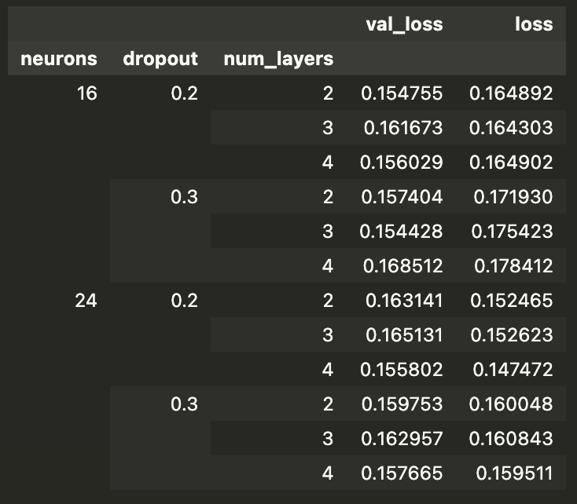

**Limited Features 3.3.19**
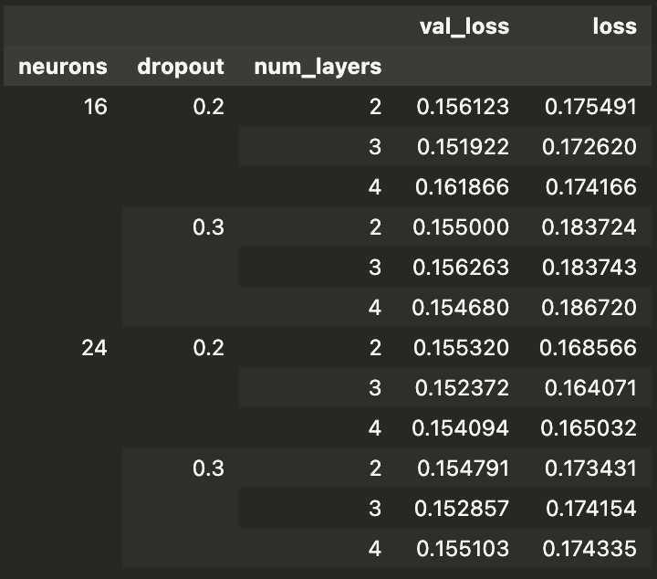

Looking across these it seems that the range of values here represents a change of ~0.01-0.014 to the val_loss. 

This means that random starts and actual hyperparameter tuning (depth, dropout rate, and neurons per layer) are having somewhat equivalent effects. 

### Bridging Thoughts

We're no longer overfitting, underfitting perhaps but it is hard to say given how little independent data we really have... A few observations stand out to me:

1. There is very little we're actually really doing as we change these hyperparameters and these features. We're looking at moving from 0.17 -> 0.15 which on the outset feels like a lot but when you exponentiate that it's really 84.4% -> 86.1%. 
2. If sampled incorrectly, or if using the "wrong" hyperparameters we can create changes as large as that our features give us... 
3. There is quite a big difference it seems between the distribution in the validation, training, and test datasets. 

All to say I feel like I'm hitting the 20% of the pareto rule... problem is I'm not entirely sure why. 

I'm fairly confident it isn't the model at this point given the fact that changing all of these major aspects is not giving me a whole load of gains. However what is rather troubling to me is the fact that, in the contrasts, the model is effectively 85% accurate... 

It makes me think that I've still got some kind of class imbalance problem that's preventing the model from learning any of the more interesting things. Or that somehow using contrasts is a bad idea... (however I've got evidence that isn't really the case...)

So here are my possible culprits:
1. Patterns do not in fact generalize across these datasets at this level of cardinality 
2. The math of contrasts does not in fact work out
3. We have some kind of decision imbalance preventing the model from learning

And the first is probably the most interesting to me because while I've created 100's of thousands of data points (and could create millions with augmentation) I've only got 20 fish in that validation set. 

Another random thought that's been floating through my head is whether these fish are in fact acting incredibly randomly and my mind is giving some pattern to their behavior... 

For example one of the big patterns is the sudden migration south by the group by the glaciers. While it certainly looks to me very deliberate, what if it's actually just randomness with a very small bias. If I allow a creature to random walk but bias specific aspects of that walk just slightly, they will indeed make very steady and consistent progress in that direction - they simply have to. 

In this same line of thinking, if there are decisions that are extremely unlikely, they will not actually end up in the dataset all that often. The algorithm can still learn to completely avoid them, but they won't show up much in the score... the score will be dominated by choices that are common - like staying in the cell you're already in... 

Hold on... what do my scores look like when distance is not the reason for staying put... 

I just pulled 3.3.6 which is the best feature set we have right now reasonably well trained and the stats for decisions that aren't based on staying where you were kind of tell it all - 5.2% geometric mean of the probability - it's not better than shakespeare's monkey. Yet it is also telling that it's finding a ~65% chance of just staying put. 

All of this gives me a couple of directions forward. 

1. I can test the classification bias issue (and the lack of generalization) by training only on decisions where the selected decision did not mean "stay in place".
2. If that totally fails I can then see if this kind of modeling can even pick up on small biases by creating some fake data (where I know how it should behave) and testing on that. 
3. I can include "perimeters" in that fake dataset to see whether low/zero probability choices actually get noted as such by the model. 

### When Distance Cannot Cheat

Welcome to m4. 

| Model | Val Loss (Contrast) | Loss (Contrast) | Val GMP | GMP |
| --- | --- | --- | --- | --- |
| 4.1.1 | 0.198 | 0.249 | 17.4% | 17% | 

That's ~3x better than we'd expect from our monkey! 

But this got me thinking... When I evaluated the performance of the models trained over _all_ of the data I evaulated their probabilities... what I really needed to do was remove the odds for the `distance=0` choices, reevaluate the probabilities, and _then_ look at the GMP for `distance>0` selections. Let's see what that looks like. 

| Model | Val GMP | GMP |
| --- | --- | --- |
| 3.2.6 |  16.7% | 15.6% | 

Haha! We are indeed biasing toward the right decisions it's just that the power of staying still is so strong it seems to wash out the probabilities for moving away from the current position. 

`(1-0.65)0.17=0.06`

The model is indeed learning about more than just when to stay and when to go. And it seems to be doing so quite well. The problem is I simply can't see the effects. 

Just out of curiousity let's see what happens when you use the full rather than limited feature set just on these subset of contrasts. 

| Model | Val Loss (Contrast) | Loss (Contrast) | 
| --- | --- | --- | 
| 4.1.2 | 0.21 | 0.213 | 

It's definitely learning something new based on the training loss, but doesn't seem those patterns are transferrable to the validation set.

Overall though I think these results remove my concerns that the contrasts are not working. The model is learning what it can reasonably well. It just seems that at the end of the data we don't have a ton of fish and so we have significant differences between our validation and training sets. 

### Bridge

The answer to my question of how to see these "hidden" aspects of the models is, I think, simple. We already noted how we can look for new problems to solve by splitting up our data into "behaviors" - individuals at specific times doing specific things - and then look at the validation loss on those specifically. This remains true - we could take specific groups of salmon, or times when they exhibit specific behaviors, and select models that are particularly good at those bits. 

But likewise what this whole distance bit has shown is that you can select specific groupings of _choices_ and not just specific groupings of decisions. Then because we're working with odds we can reevaluate the probabilities with the choices we don't care about removed and eval on that instead. 

Furthermore as we've just seen we can train models specific to any one of these cases and then, when we've found features that work, try to combine them. If the combination doesn't work first round we can add artificial features that tells our model which group is which to make sure our architecture is capable of telling the difference before just concluding there's a missing piece of information. 

All of which is to say we can continue this model development by looking at loads of different GMP stats across various different choice and behavior groupings. And we can break up the study by studying each of these groups individually and then trying to stitch them back together. 

Sweet!

This method works... I think it's about time I go ahead and collect all I've learned into something others can learn from. Time to write up a whitepaper. 

### More Observations

- Because I'm taking the exact distance between h3 cell centroids there's actually information about heading mixed in with distance which is making illustration and generalization a little difficult. This makes me worry about false precision on the part of the movement heading too... I think I'll bin that as well. 
- Having a separate test set is really not helping. I'm just going to pull it in as part of the validation test set. 


### Prepping Results

The first observation anyone will make of this data is that it seems like the vast majority of what's being explained is just how far a fish is likely to go. How to pull this out so we can understand what the following (more than just distance) models are telling us? 

For one thing we can look at how well staying put versus going some distance is predicted. 


### Found Something Weird

I'm getting probabilities around 55% for the distance only model for staying in the same spot even though the real probability is 65%... so something is definitely off here. 

In our contrasts what would we expect the rate to be? We're sampling $N$ different decisions and then pulling $M$ choices 
each time. Assuming that $M$ is constant across decisions (just for simplicity) we'd have $p N M$ cases where we stay ($p=0.65$) and $(1-p)N$ cases (on expectation) where we move. So the probability in the contrasts would be:

$$p_c = \frac{pNM}{pNM+(1-p)N}=\frac{pM}{pM+(1-p)}$$

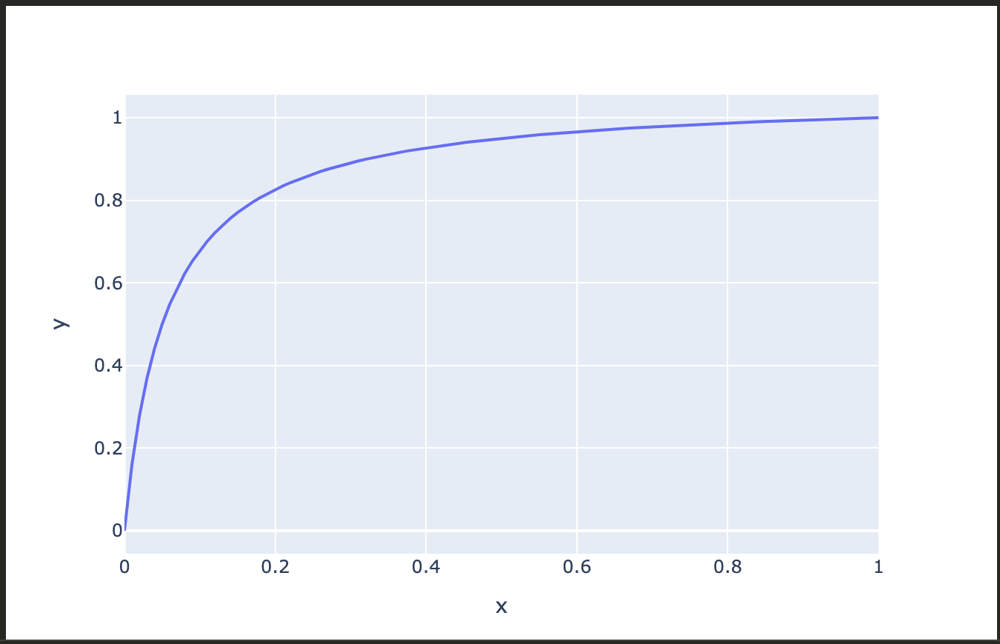

Looking at this graph in `plotly` I found that the $p_c$ for $p=.55$ is 0.959 whereas for $p=0.65$, $p_c=0.972$, i.e. it's only $~1.4\%$ larger. So this just might be a sensitivity issue... 

What I find in the actual contrasts is a $p_c=0.972$ as expected and a validation set GMP over decisions with `distance=0` of 0.958 all of which lines up neatly with the above. 

Looking at 500 samples at a time (batch size) the $p_c$ histogram over 100 such samples looks like:

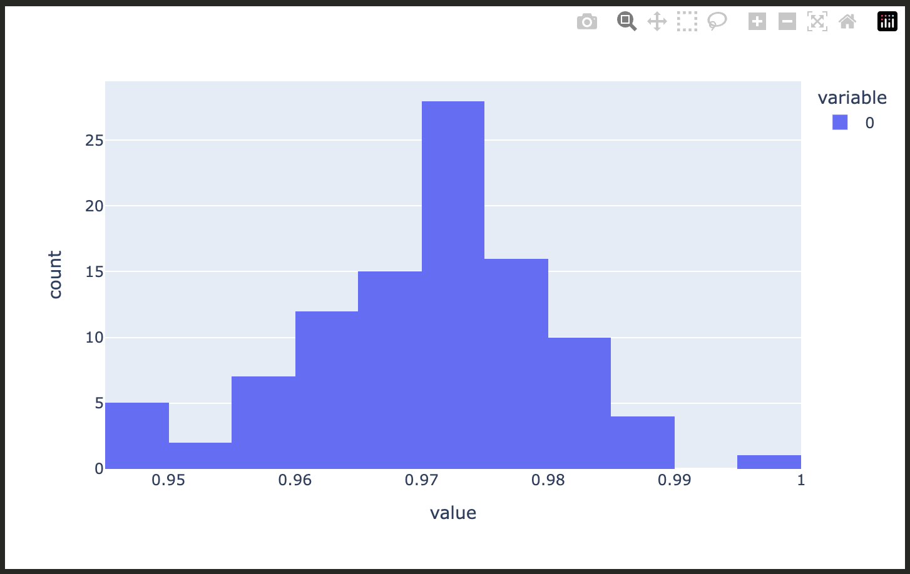

Definitely could just be running into learning rates that are too high or something like that. 

Alright just pulling things together then...

On `m3.a4` we created three models, v1, v2, and v3 all of increasing complexity. In every way that I've looked at it each is an improvement on the prior so that's very good. 

The problem I've just discovered is that it seems the model is have trouble fitting the contrasts itself and this is leading to a large error in the "actuals" due to the difference in sensitivity.

Before I can move forward with results in my little white paper I need to sort out why this is happening. 

But important to keep in mind (for my own sanity) that this process is generally working. I just need to figure out why for one feature it's not just "learning the bins" so to speak. Once I've got it sorted we can come back, retrain these three, and resume detailing how the rest of the process is indeed working. 

### Where are the Bins?

Okay, first question... if we got this right (in terms of bins) what _would_ the loss be? 

The answer is a training loss of 0.171 instead of 0.173, so also within ~1%. And what's interesting is if we look at this histogram of errors for contrast pairs whose selected and contrast distances have at least 1000 representatives

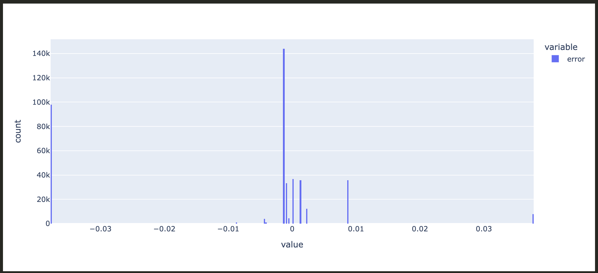

and the following breakdown by selected and contrast (x10)

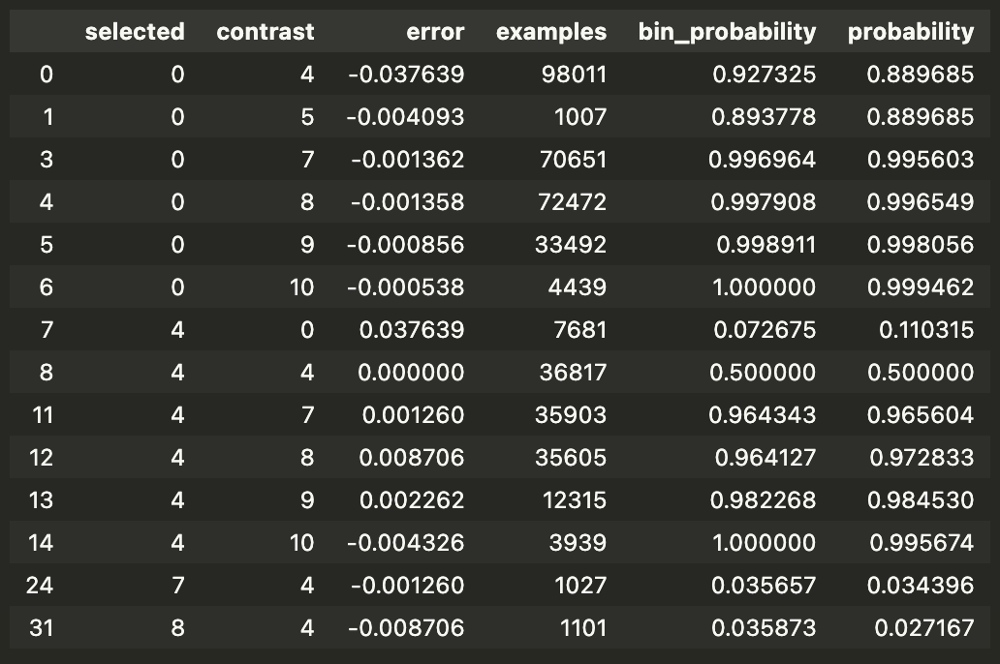
(Bin probability is computed from the )

We can see that it is simply the choice from distance 0 -> distance 0.4 (0.4x10 in the above) that is throwing us for a loop. All the others are within 1\% or have very few examples to their name. 

We have two problems as I see it:

1. This should really be able to hit this spot on.
2. These small errors show up as huge errors in the underlying predictions 

I'm slightly less worried about the latter because this really is doing a tremendous job on most of these points. 

There's a lot of potential things that could be going wonk. But I should, with enough flexibility, be able to get the model down to its ideal training loss. Let's start there. 

### Training Loss Minimized

1. Too stochastic, the space changes with each batch and so the thing can't learn its way in.
2. Needs more time to explore the whole space.
3. Learning rate is too high and its pinging about the space. 

For 2 I went ahead and did a 8x8x8x8 with a learning rate of 0.0375, batch size of 500, and 200 epochs (local_23). 

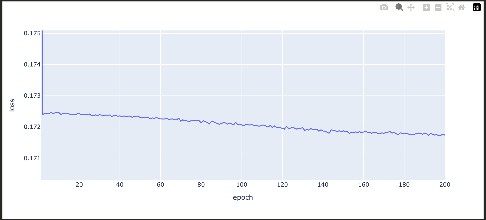

That's a rate of about 3e-6 per generation. That means roughly 333 generations to go from 0.172 to 0.171... which is not totally unreasonable... 

Running at a learning rate of 0.025 (local_25) gave us a similar loss rate of 2.875e-6 whereas increases the learning rate to 0.05625 dropped it to 7.5e-7.

I've just also learned that the loss reported by keras is actually the average across the batches per epoch, so if you have a smaller batch it gets added in with the same weight as all the other batches... I noticed this as my manual eval was giving a training loss of -0.174 even though the history said -0.172... and the validation losses were the same in both cases. 

Worse than this it is getting the loss after having mucked with the weights... so I went and ran the training data through as the validation data and this is what the real loss looks like...

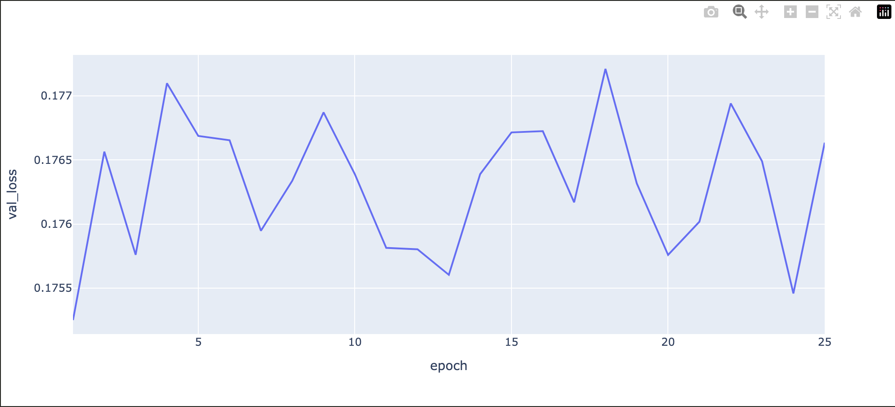

I've been reading a lie this whole damn time... 

I went back to a much larger batch size (10k) and went back to the adam optimizer and look what I got (note val loss is really train loss)

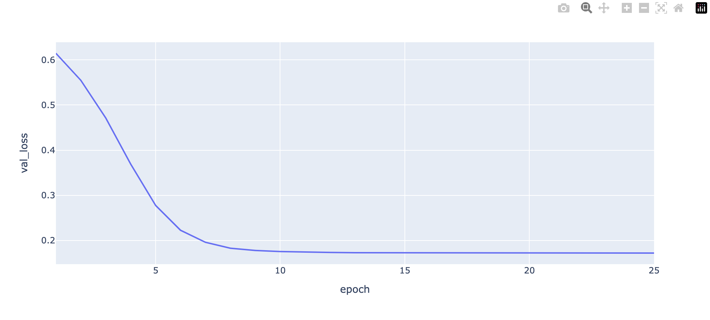

And here we go, after just 25 generations way better results than before:

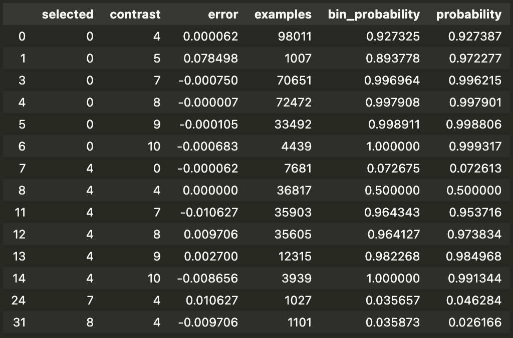

And inferring over the normal dataset (not the contrasts) I'm now getting a 68% average probability (arithmetic average) for choosing `distance=0` which is fine and dandy. 

Problem solved!

**Conclusions**:
1. We've got to have a batch size large enough to give reasonable estimates of the probabilities involved otherwise batch to batch it just shifts around like crazy and we learn nothing. 
2. I need a way to report the actual training loss so I can diagnose things.
3. My ML intuition was working all along I was just looking at lies (what a relief)

**Next Steps**:
1. Incorporate real training loss in mimic and allow for updating the adam params while I'm at it.
2. Re-hyperparameter tune the three models.
3. Get back into displaying results. 

### Retuning

Started out without considering any dropout to see what would happen. 

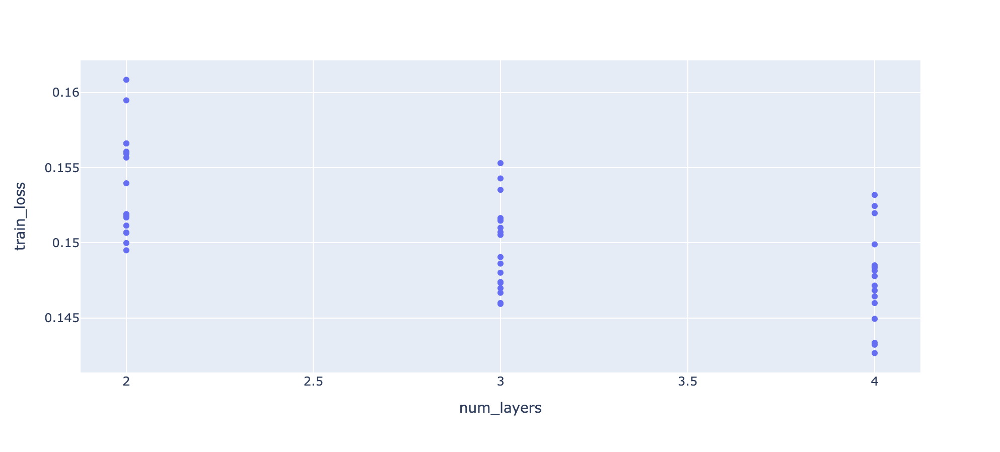

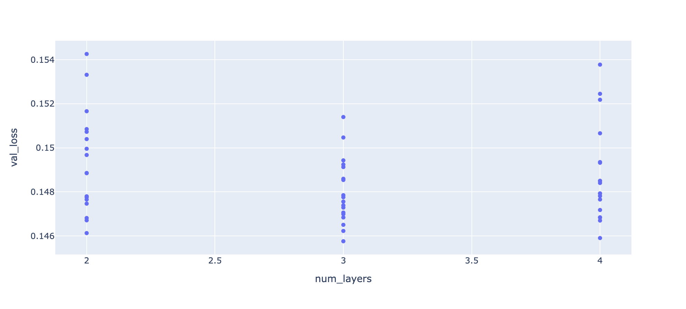

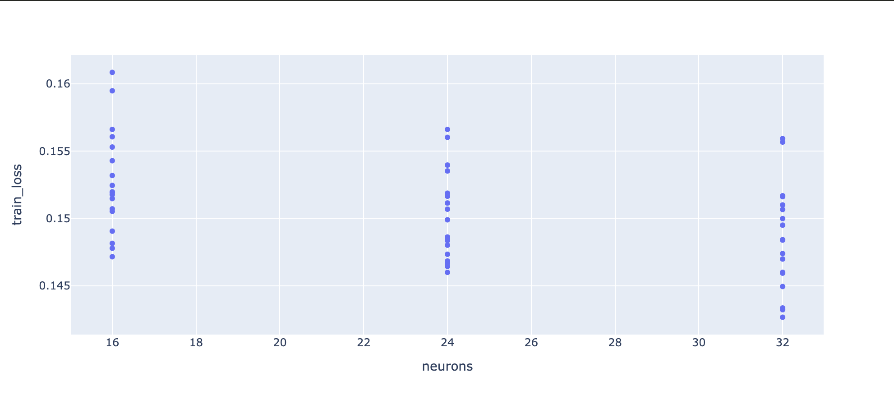

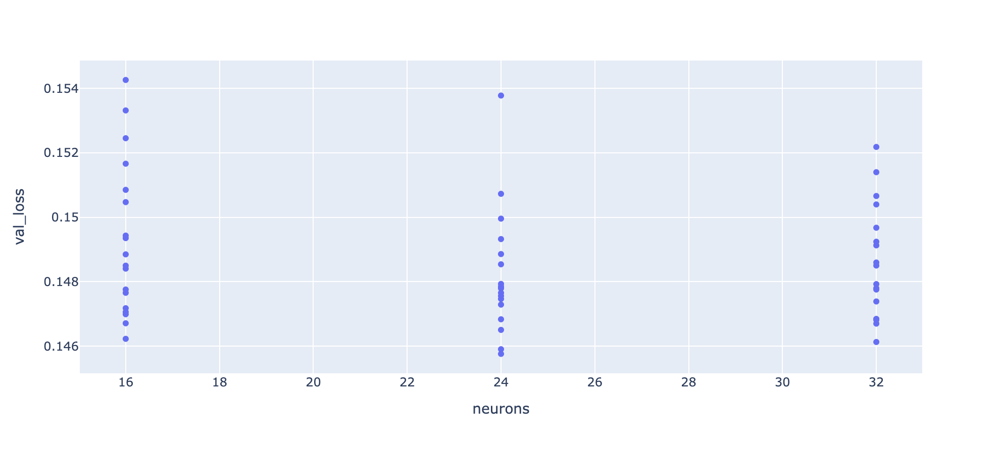

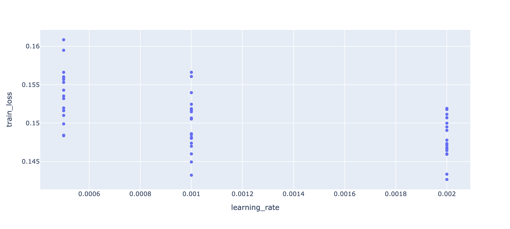

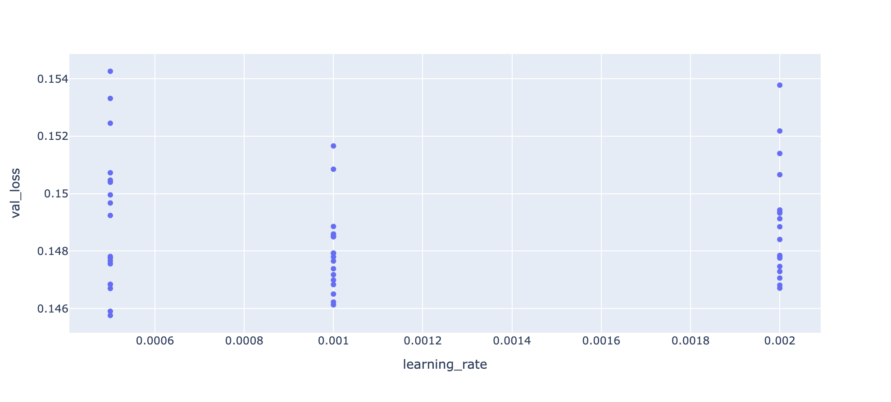

This is far more what I've been expecting all along in terms of the train loss getting better and better as we add more degrees of freedom but the validation loss not necessarily following the same pattern. 

Here's the best model from the above by validation loss:

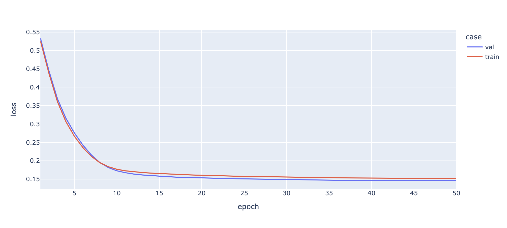

And then the best by train loss:

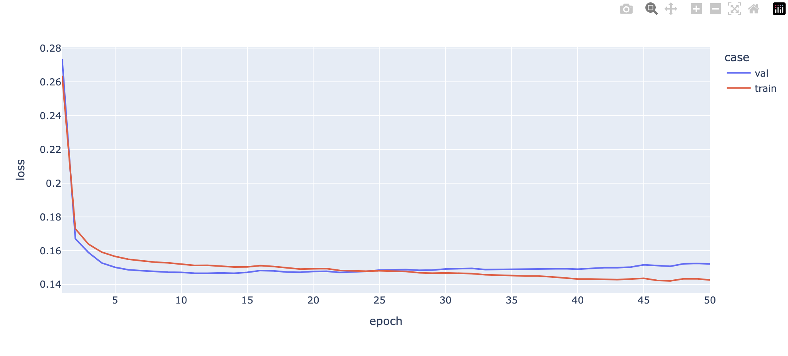

So some regularization may help a tad here. (This for the four features btw). 

Looking at the differences in `val_loss` from experiments that have the same config (but just different random starts) suggests that either I need to run for more than 50 epochs or I need to just run a bunch of seeds. I'm seeing ~0.001 differences in the larger models. 

Results suggest a very small amount of dropout may be helpful but not by a whole lot. So I'll leave it out for now. We can do a more refined search in and around 10% dropout later if we care to. 


Ended up going with this over our three models (3.4.5, 3.4.6, 3.4.7)
```python
grids = {
        "batch_size": [10000],
        "random_seed": list(range(5)),
        "epochs": [100],
        "dropout": [0],
        "num_layers": [3, 4],
        "layer_size": [24, 32],
        "learning_rate": [0.0005]
    }
```

All models look good! They are behaving as I'd expect them and seem to be giving the right probabilities. Interestingly the GMP's did not change all that much and the models look pretty similar from that perspective. Which makes me believe that an important part of this whitepaper is going to be explaining how to figure out what your model has learned. 

