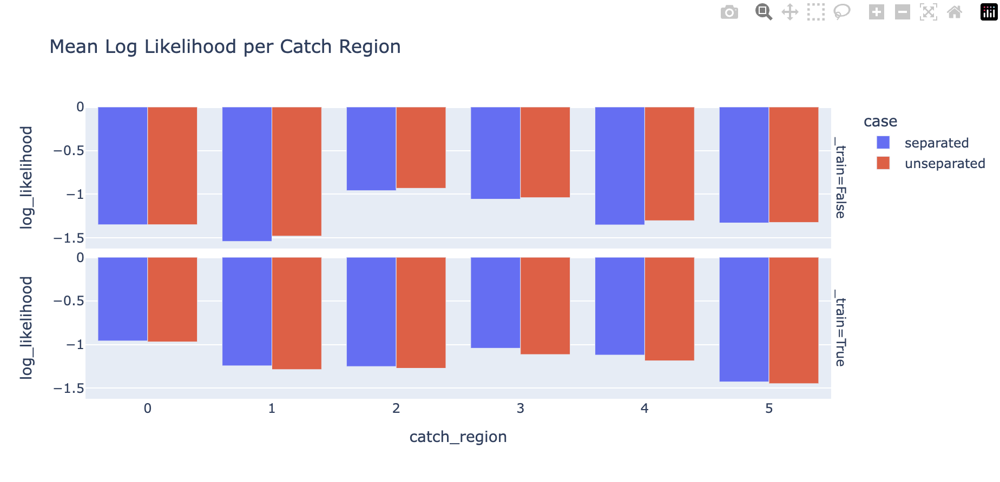
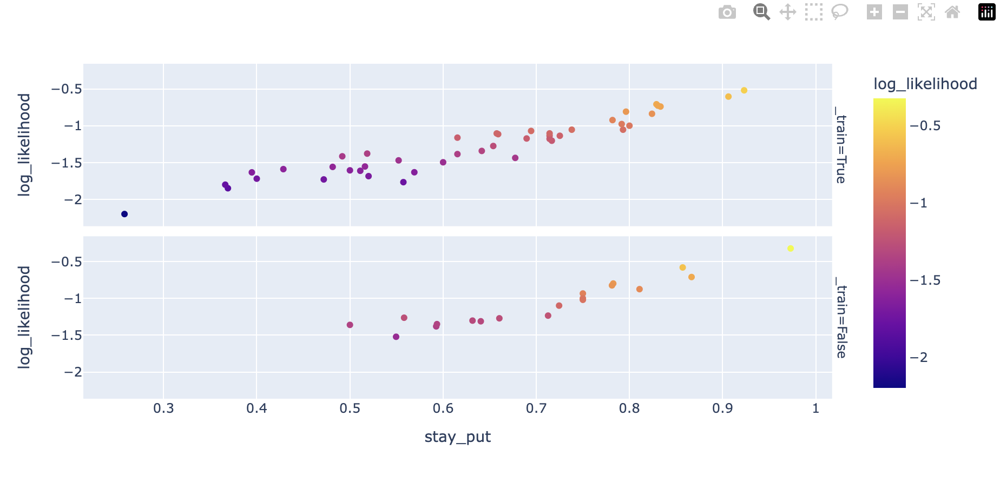
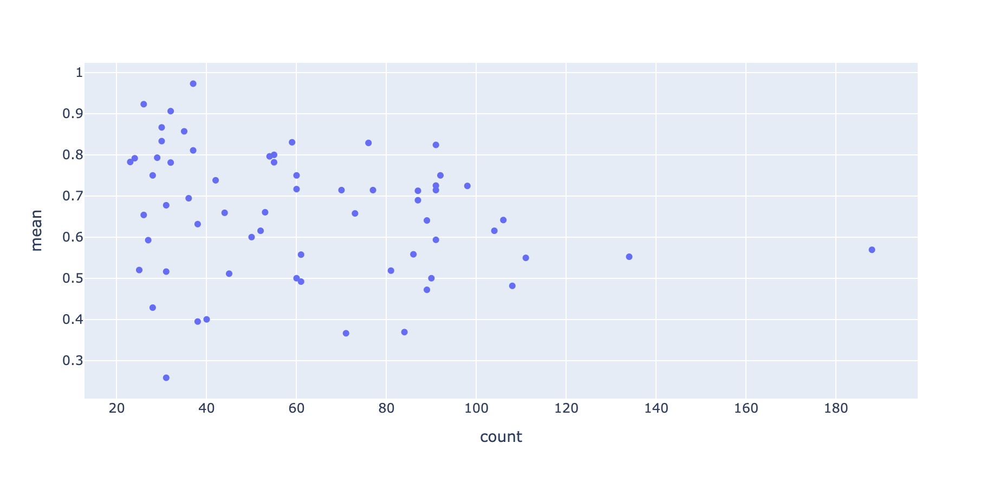
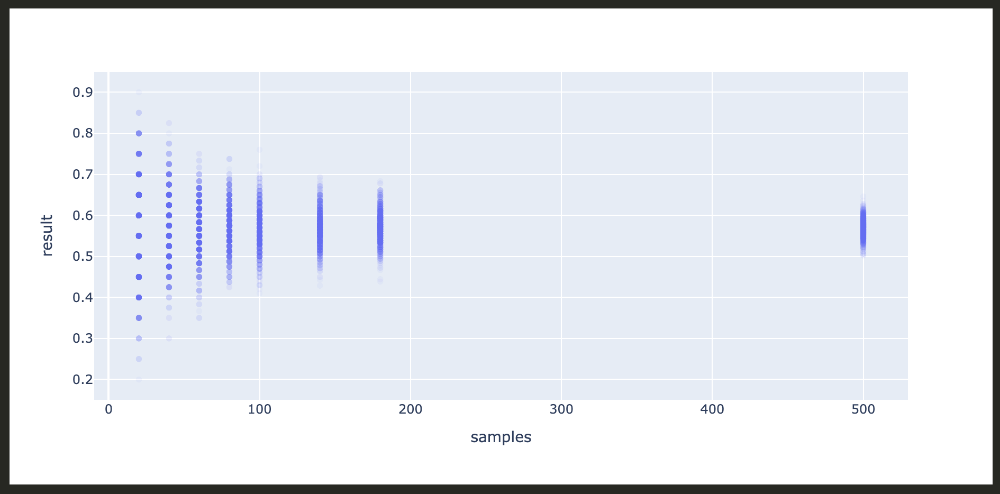
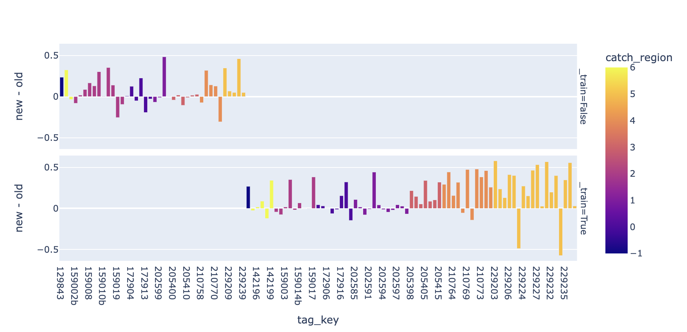
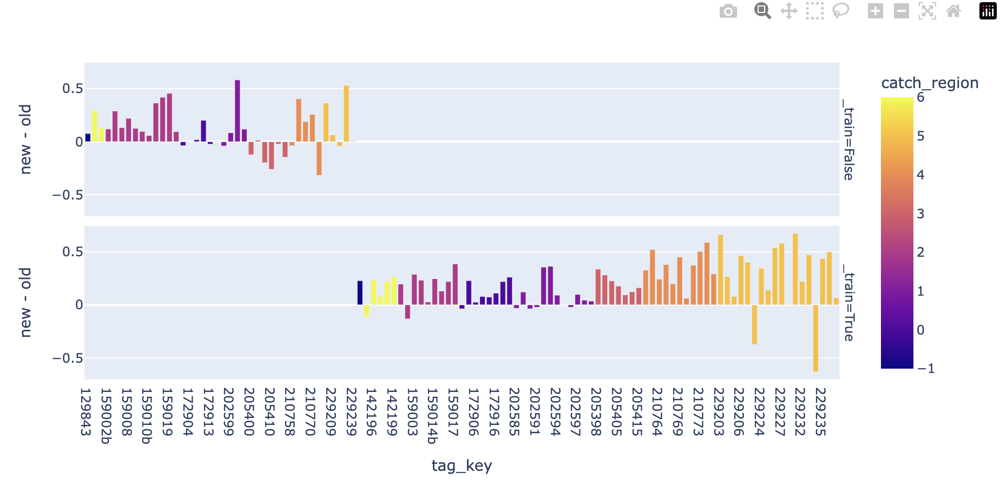
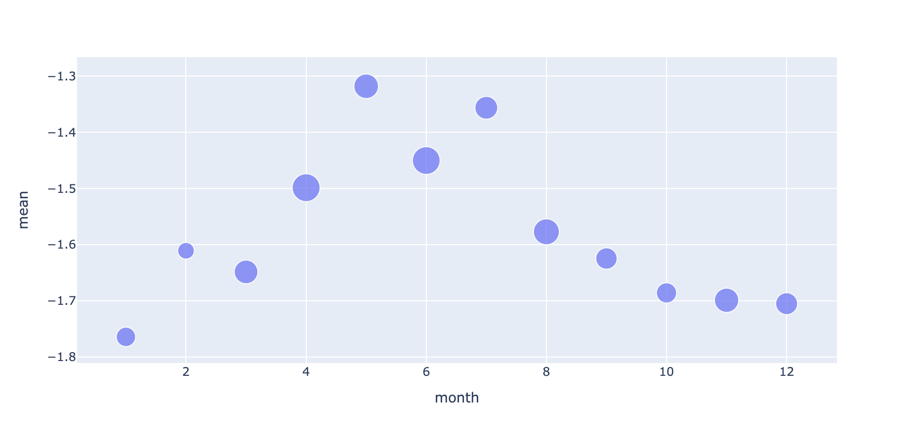

# January 24, 2025

## Notes from the Week

### What's Up with Genetics

The past few times I've tried adding the genetics into the model (and by that I just mean origin) I've not seen any advantage. Putting my debugging hat on I wondered if there was just something wrong with the way I was representing the features. So what I did was train four distinct distance only models for each of the origins. What I found was that indeed there was a very slight performance boost on the training data. What was interesting is that when I compared to a model where the feature was present and all origins were used in the training data, it picked up on the difference betweeen unknown origin and known but couldn't distinguish between the origins. So, that left me wondering whether my use of 360 degrees of latitude for unknown was causing problems. I therefore went ahead and trained only on known and found that, indeed it did a better job of distinguishing between the groups, so that'll be something to keep in my back pocket. However during this investigation I also found that the patterns between the groups in the training data are all flipped about in the validation data, so the validation loss across these models is all the same (practically speaking). Therefore genetics are only going to end up mattering when some other kind of features come into play. But at least I know how I normalize and account for the unknown is going to matter. 

PS: Ended up just for funsies building a better normalized set of features (0->1) for the home lon and lat and saw a performance boost for the known origin model, still not good enough to matter but it matched the validation loss from the three individual models trained per origin - so normalization will do the trick here and I don't need to do anything funky. 

### Per Region Differences

From the manuscript I've been putting together it has become quite clear that the regions the fish were caught in seem to operate quite differently. Specifically the addition of the environmental features actually has a quite negative effect on some of the regions. What I'm wondering is whether this is because those features are actually not helpful at all, or if they are just helpful in some way that is getting washed out by the averaging effect of the model not being able to tell the difference between regions. To this end I'm going to employ a similar strategy as per the above and train a model for each region, then I'll be able to look and see whether the models perform significantly better per region or not. If they do that'll mean I need to find some distinguishing factor between the regions. If not then it means that there's something, possibly shared across them all, that I need to find. 

The above is the result (separated is the separately trained models vs unseparated which is the one model [no region separation features mind you]).

This is superbly interesting. The separable models definitely do minutely better in the training data but what they learn _does not_ generalize... the validation loss is worse in all cases but the training loss is better. So whatever is being learnt by this model generalizes across the regions and yet clearly the model is not as predictive in all cases. That is to say that there is something else, not correlated simply with the region, that is distinguishing between individuals and therefore between regions... bit of a mind bender that... 

It is not an averaging effect across regions but the fact that something else is just plainly missing. Something is modulating behavior without being tied directly to region. 

Time to find some exemplars and go looking for what may be going on... 

### When to Move

All in all the biggest determinant of log likelihood seems to just be individuals that move a lot vs individuals that move a little. 

The x-axis here is just the rate at which selections where choices to stay put and the y-axis is the mean log likelihood over all the individuals decisions with each point being a different individual. That is an insanely neat pattern. 

What's really interesting is that the distribution of stay put selections looks like this:

where the x axis is now the number of samples (days) and the y axis is the proportion of choices that result in "staying put". 

Now compare this to a series of trials where we sample a binomial distribution with `p=0.57`:

We could totally walk away from this assuming that the choice to stay is a totally random process and the distribution of different observed rates is simply due to randomness. 

We therefore have a couple of choices moving forward:

1. Assume staying put is totally random and focus on trying to understand _moves_.
2. Try to figure out which of these stay put or move choices are actually predictable. 

The thing that's interesting about this is that, given the precedence to stay put, if we really want to study it we will need to remove the moments the fish stayed put because otherwise the probabilities for movement are always going to be exceedingly small (~18 choices divided amongst 1 - 0.57 remaining probability). 

I think I've really got to come back to a management perspective to figure out what the most useful thing to attack next is. If it does turn out to be movement then I need to swap the things I've training over and the loss I'm looking at. 

But I think the big conclusion from today is that I need to break up my study into the following components:

1. The decision to stay put or move.
2. The decision to move a lot or a little.
3. If moving where to move. 

Trying to look across all of these at once is just obscuring my vision. 

Tomorrow I'll brainstorm and figure out which of these to focus on first. 

### Directionality

It seems to me that the best thing to study first is "where to move when movement happens" as this will likely inform
why the fish are moving as well. To this end I'll:

1. Create a new dataset with "stay put" and "long range" decisions removed
2. Rebuild contrasts and all of that
3. Build a movement heading model as a baseline (cos sin features)
4. Build the food model 

Then we'll be able to take the results from these analyses as our starting point.

Alright so first off we have a model just based off of heading:

Looking at the training examples we can see that several catch regions did really well and a whole bunch are very meh. 

For the food model (above) we see that now we are more generally helpful over the training data but that the results don't necessarily carry well over to the validation data. 

I also went ahead and build out models including the home region (from the genetics) and the seasonality and didn't see any improvements. The model could certainly drive the training loss down a hell of a lot more but nothing showed up in the validation data. And given the studies above I'm not worried about it being represented incorrectly now. 

As I was going through the individuals and their decisions however I started to notice that during the winter it seemed like we couldn't get anything right (at least not compared to random) so I decided to plot out the average log likelihood per month over all decisions. And this is what I got:

What I then realized is that my primary productivity features are only available when the sun is shining (i.e. during the warmer months [duh]) and the migration like behavior also only happens during the summer-ish months. So for all other months of the year I just don't have useful features. 

So I'm going to grab the bathymetry and surface temperature data next and go from there hopefully they will have something to say as we know there's a generally tendancy to at least dive deeper in the winter... 