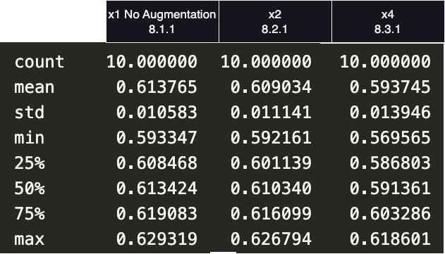
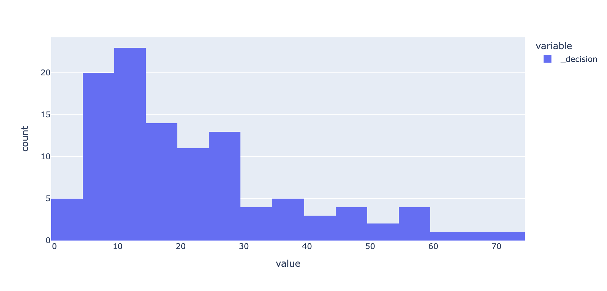
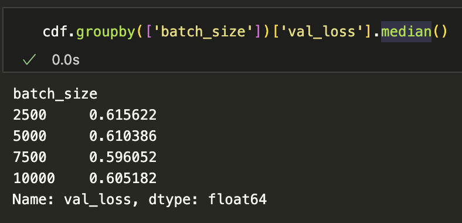
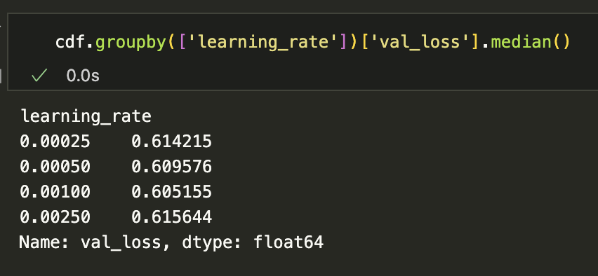
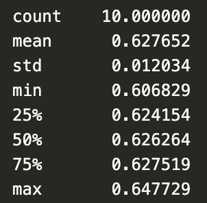

# January 31, 2025

## Notes from the Week

### What about Augmentation

Ran a few experiments where I "augmented" the data by adding noise. 

This is a pretty significant difference if I'm being totally honest. These were all with a 16-16-16 and dropout of 10% arch. Note how much variability there is just in seeding. 

I tried 8x and it didn't make a difference beyond the 4x. 

### Bias?

Something I've been consistently noticing is that the "best" examples are almost always these fish with very few movement decisions. I'm wondering if I'm biasing my learning toward them because they are easy to fit but end up representing as much of the dataset as any other individual. 

Looking at the data:

one can see that 25 of the fish have less than 10 decisions where they actually moved! 

I'm going to go ahead and filter these out to create a training dataset and then infer on the full set to see how things change...

So the answer is that 8.3.1 got a -0.58 score on the validation set (not including individuals with less than 10 movements) and 8.4.1 (which is trained without those slow pokes) got -0.61... so not helpful. 

### Batch Size and Learning Rate?

I haven't retooled the batch size or learning rate given I've moved onto the movement model. So let's see if there's any movement there. 

Seems we chose the right ones. 

### Binning?

So I was curious as to whether binning was as good as data augmentation. I therefore ran experiment 7.1.15 which has binned features but is otherwise the same as 8.1.1. 

That's a hell of a lot worse than data augmentation. 

### Tuning Down

I'd like to figure out if any of the features in this `8` class model are not worthwhile before moving on. More or less just want to finish by saying I've tried the features I have and know which ones are useful at the present time. 

| Model | Removed Feature(s) | Min Val Loss | 
| --- | --- | --- | 
| 8.3.1 | N/A | 0.57 (kinda a fluke 0.58 was consistent) | 
| 8.3.5 | `sin_mh`, `cos_mh` | 0.6 | 
| 8.3.6 | `cos_time`, `sin_time` | 0.58 |
| 8.3.7 | `normed_salinity` | 0.62 | 
| 8.3.8 | `normed_log_mlt` | 0.62 | 
| 8.3.9 | `normed_elevation` | 0.575 (consistent) | 
| 8.3.10 | `normed_elevation`, `cos_time`, `sin_time` | 0.59 |

This would suggest I can remove elevation and time which is super interesting... 

I tried adding region to 8.3.10 and ended up getting 0.6 so not helpful. 

### Validation Variance

If I repeat this process but with different sets of train and val how much does my validation loss move about? Is the 1.2x I'm seeing right now compared to random guessing hold up? 

| Model | Val Loss (C) | Val Loss (T) | Multiplier |
| --- | --- | --- | --- | 
| 8.3.9 | 0.575 | -1.53 | 1.24 | 
| 8.6.9 | 0.585 | -1.56 | 1.2 |
| 8.7.9 | 0.58 | -1.55 | 1.21 |
| 8.8.9 | 0.56 | -1.54 | 1.22 |
| 8.9.9 | 0.61 | -1.59 | 1.16 |

Damn that's way more reliable than I thought it was going to be... 

### Back to the Full Picture

Now that I've got a reasonable model for movement let's see if we can still pick all of this up when we leave the "stay put" decisions in place. Note that I will not be including movements past 50km to centroid as they are just far too rare. 

Model `9.2.9` has our answer :) -1.58 was the loss on the validation data for moves and -1.12 overall. So slightly worse on the movements than if we train the movements by themselves (but that makes sense given the lack of moves). I think this will be usable for the next step - actually plotting all of this stuff out using spark. (Also note that I ended up finding a bump back to 10,000 batch size was helpful)

### Spark!

Alright we've got a model that seems reasonably useful, now I want to see what things look like all told:

1. Get an engine with the new model running
2. Create an animation of diffusion over space

Once I've got these basics it's time to step back and think about better tooling around the engine and the views. :) 

And here it is - [Movie](2025_01_31/SalmonMovement.mov). I seeded the northern pacific with an even distribution of chinook salmon, plugged my model into their brains, and let them disperse. Quite cool to watch. What stands out to me is the concentration in the EBS, the movement along the south-east coastline, what looks like a congregation near the north pacific gyre, and then of course the shift south east towards the end. Also rather odd is the fact that there's some kind of blockage in movement past Kodiak Island. Note that while generating the probabilities of diffusion took around 2 hours in spark I was able to seed with my distribution and rebuild the diffusion within ~4 minutes. That means if you wanted to use a different (and actually reasonable) abundance distribution, add in some mortality, and so on you wouldn't need to repeat the two hours, only the 4. So this is a reasonably quick way of getting at everything in the second chapter of my thesis - all that I need to do with this now is add a wrapper on top of the diffusion that makes creating inputs easy (right now you have to build out your own grids by hand). 

I also realized in going through this that given how the problem is setup now I don't even think I need spark. I should be able to use a combination of athena building my possible state space (all the places the fish could go and be) and then use mimic to run inference over all of that. So my next step is to go back through what I've done to get this far, and all of the model config, feature building, etc and just tie it up into a set of instructions anyone could repeat. I think I can turn that thing into a guide to behavioral modeling and diffusion simulation at the same time. Exciting stuff. :) 

