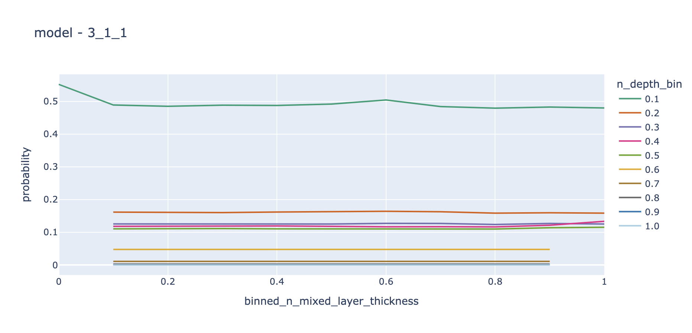
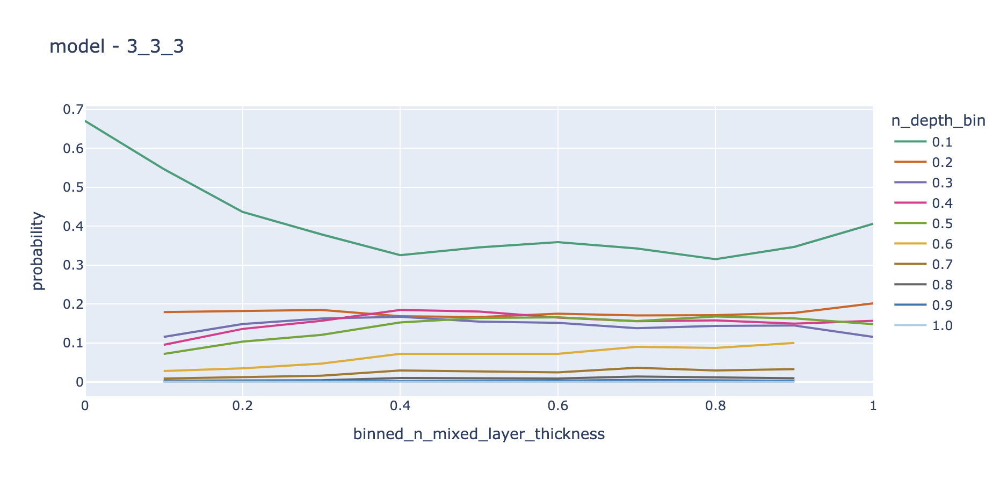
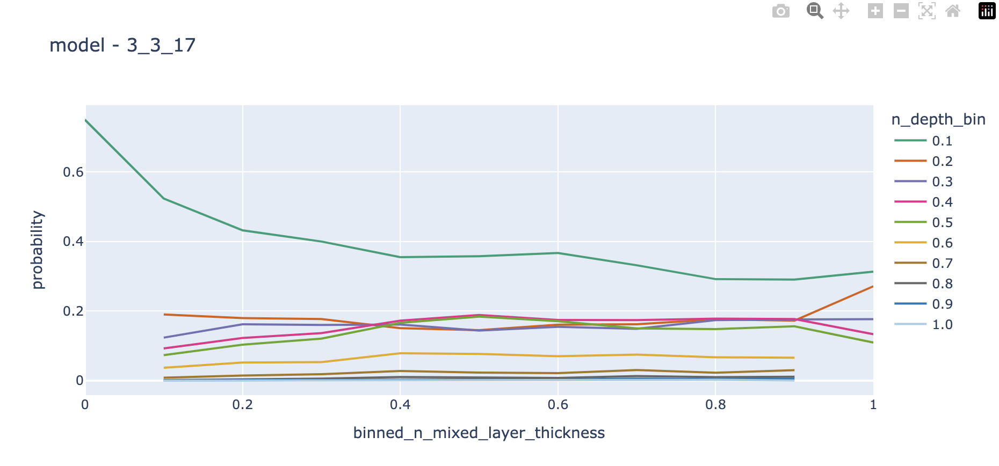

# Depth Model v2

## Week of February 14, 2025

### Confirmed Null Model

Using only `n_depth_bin` as a feature we were able to build a model that replicates the rates of the depth bins at large with no other information. 

| depth_bin | _selected rate | probability from model | 
| --- | --- | --- |
| 25 | 0.464 | 0.487 |
| 50 | 0.166 | 0.161 | 
| 75 | 0.134 | 0.125 | 
| 100 | 0.107 | 0.118 | 
| 150 | 0.130 | 0.110 | 
| 200 | 0.049 | 0.048 | 
| 250 | 0.013 | 0.011 | 
| 300 | 0.006 | 0.003 | 
| 400 | 0.002 | 0.001 | 
| 500 | 0.000 | 0.000 | 

This was with model `ab17d4ce30981b9d7630da4d7adbf7fd7cb88a9bfee2b37ed60254e097e8ffdc` in `3.1.1`. (NLP-C of 0.525) Which had the following configuration:

```python
{'batch_size': 40000,
 'dropout': 0,
 'epochs': 25,
 'layer_size': 16,
 'layers': ['D16', 'D16', 'D16'],
 'learning_rate': 0.001,
 'num_layers': 3,
 'optimizer': 'Adam',
 'optimizer_kwargs': {'learning_rate': 0.001},
 'random_seed': 2}
```

It does not seem like batch size makes much a of a difference at this point as we got equivalent scores at a batch size of 5000. 

Moreover 3000, 4000, and 5000 decisions per individual had largely the same score. The 3000 runs took 1:47, the 4000 runs took 2:35, and the 5000's took 3:07 (this was all for 25 epochs). What I'll do is run the 3000's to help me explore more quickly and then at end of day we can kick off some 5k's to see how well this model can learn with more data. 

Just for reference a true null model (log odds always 1.0) would give us a NLP-D of -1.80 whereas this model is giving us a NLP-D of -1.43, i.e. we are ~1.45x more likely to pick the correct answer. 

### Adding Time

| model | features | NLP-C Train | NLP-C Val | 
| --- | --- | --- | --- |
| 3.3.1 | --- | 0.471 | 0.521 |  
| 3.3.2 | sun | 0.469 | 0.522 | 
| 3.3.3 | orbit | 0.440 | 0.487 | 
| 3.3.4 | sun + orbit | 0.437 | 0.477 | 

Alright this is somewhat suprising... I was expecting the diurnal pattern to show up here but when I look at the actual data it seems like the diurnal pattern is not quite as explicit as I was expecting (indeed it's hard to pick it out from the noise). 

I'll probably do some debugging of that to make sure I didn't much up the sun_sin and sun_cos features but for now we'll just assume that that behavior is somehow related to something else... 

### Starting to Add Environment

| model | features | NLP-C Train | NLP-C Val | 
| --- | --- | --- | --- |
| 3.3.3 | orbit | 0.440 | 0.487 | 
| 3.3.5 | + elevation | 0.442 | 0.489 |
| 3.3.6 | + salinity | 0.436 | 0.484 |
| 3.3.7 | + mixed_layer_thickness | 0.432 | 0.486 |
| 3.3.8 | + temperature | 0.431 | 0.489 | 

One interesting note about 3.3.3 vs 3.3.5 is that while the former had clearly leveled out, 3.3.5 was still dropping quite regularly at epoch 25. So I may have just not let it run long enough. 

Alright these models are being weird in the sense that I'm not obviously overfitting anywhere which makes me think I've not enabled enough variance in the underlying model. 

### Finding the Point of Overfit

So given I was having trouble getting 3.3.6 to overfit (even with 5 layers and 32 neurons a piece) I cranked it up to include just about every feature in 3.3.9 and saw clear overfitting in the 25k batch size runs. Interestingly upping it to 250k stopped the overfitting entirely but my NLP-C Val was still just 0.486. 

At this point I was beginning to wonder why this stuff was having so much trouble finding any patterns beyond the seasonal stuff. So I started plotting how the frequency of selection changes for each depth bin as a function of each of the features (just two dimensional plots) and found only the following had any discernible pattern that held up when moving from train to validation sets. 

```json
[
    "n_depth_bin",
    "cos_orbit",
    "sin_orbit",
    "cos_moon",
    "sin_moon",
    "n_mixed_layer_thickness",
    "n_temperature",
    "n_nitrate",
    "n_silicate",
    "n_salinity"
]
```

So I'm going to give this a run overnight and we'll run for a hell of a long time to see if we can get anything reasonable. Looking at the hyperparameters for 3.3.9 I can see that 32 neurons per layer _always_ did better in the 250k batch size runs whereas 4 layers seemed to do better than 5. So I'm going to try 32 and 48 neurons per layer and 4 layers. The runs took 3.5 hours to complete with a 250k batch size so I can only really run 75 epochs if I start 'em right now. 

Welp I mistyped and put 25k instead 250k... so absolutely everything overfit :/ ...

Alright after having properly run these things we see no benefit from the additional features in terms of validation loss. 

I suppose what I'm confused about at this point is whether or not the lack of additional learning is because these features are insanely colinear or whether the model is having trouble generalizing the learning. The other thing I'm worried about in the back of my head is that the batch size is regularizing too much and not allowing the model to learn more interesting things. Finally, I'm wondering how much this extra data is actually doing for us. 

Let's start with the first by looking at the mixed layer thickness feature on its own.

### Mixed Layer vs Seasonality (do the features say different things)

So 3.3.11 has just mixed layer thickness and the NLP-C is 0.462 for the train and 0.506 for val so it is better than the null model (0.521) but definitely nowhere near as useful as the seasonal (0.487). So this reinforces my belief that the season captures much of the same info as mixed layer thickness and more! 

### Speedy? (Are the number of contrasts helping)

| model | samples per individual | NLP-C Train | NPL-C Val |
| --- | --- | --- | --- |
| 3.3.11 | 3000 | 0.462 | 0.506 | 
| 3.4.11 | 1000 | 0.461 | 0.512 | 

The additional data seems to be helping quite a bit! (I may end up running some longer runs with 5000 samples per individual)

### Lower Batch Size Without Overfitting? (Is my batch size too high to find smaller patterns?)

2 layers by 16 neurons a piece with dropout on 25k batch size (on 3.3.10) managed to avoid the overfitting and gave us an NLP-C Val of 0.487. We also got a 0.487 with 32x2 (no dropout) on 100k batch size. So I don't think the lower batch size matters all that much. (Which is what we've seen in the past).

### Brick by Brick

| model | features | NLP-C Train | NLP-C Val | 
| --- | --- | --- | --- |
| 3.3.3 | orbit | 0.440 | 0.487 | 
| 3.3.5 | + elevation | 0.442 | 0.489 |
| 3.3.6 | + salinity | 0.436 | 0.484 |
| 3.3.7 | + mixed_layer_thickness | 0.432 | 0.486 |
| 3.3.8 | + temperature | 0.431 | 0.489 | 
| 3.3.12 | + moon | 0.450 | 0.493 | 
| 3.3.13 | + nitrate | 0.436 | 0.481 | 
| 3.3.14 | + silicate | 0.446 | 0.490 | 


One note is that the lunar model seemed to stagnate for a while and then started dropping and clearly still was at 25 epochs when the training stopped. So there may be something there but it's unclear. 

From the above it seems that we have the following candidate features (in order of value in 25 epochs):

- nitrate
- salinity
- mixed_layer_thickness

So we'll do one set just with nitrate (but longer runs), one with nitrate and salinity, one with nitrate and mixed layer thickness, and one with all three (in addition to the seasonal patterns of course). 

Interestingly when looking at the hyperparameters the more complex models did better for 3.3.13. So I may bump that up as well (or at least provide some more options to try).

Alright set them off with 75 generations... we'll see how they look in the morning. 

| model | features | NLP-C Train | NLP-C Val | Lowest NLP-C Val |
| --- | --- | --- | --- | --- |
| 3.3.13 | orbit + nitrate | 0.433 | 0.479 | 0.479 |
| 3.3.15 | + salinity | 0.403 | 0.479 | 0.477 |
| 3.3.16 | + mlt | 0.424 | 0.482 | 0.478 |
| 3.3.17 | + salinity + mlt | 0.430 | 0.478 |  0.478  |

The salinity got down to 0.477 for a little bit and then started overfitting. Interesting that it looks like the salinity and mlt model was probably still learning. 


Alright for a final comparison:

| model | features | NLP-D Val | Geom-P Val | Expected Rate of Correct Guesses | 
| --- | --- | --- | --- | --- | 
| null | | -1.740 | 17.6% | 17.9% |
| 3.1.1 | depth_bin | -1.457 | 23.3% | 28.9% | 
| 3.3.3 | + orbit | -1.371 | 25.4% | 30.2% |
| 3.3.7 | + nitrate + salinity + mlt | -1.352 | 25.9% | 30.7% | 

I also have definitive proof that things like mixed layer thickness aren't really helping 'cause the orbit model has em sorted:







Each of these gives the mean probability per mixed layer thickness bin across the three models. Note how 3.3.3 gets the pattern before mixed layer thickness has even been added! 

## Week of February 21, 2025

### Full Data Models

| model | features | 
| --- | --- |
| 3.1.1 | |
| 3.1.3 | orbit |
| 3.1.4 | orbit + sun |
| 3.3.13 | orbit + nitrate | 
| 3.3.17 | orbit + nitrate + salinity + mlt | 
| 3.1.18 | orbit + sun + nitrate + salinity + mlt |

### Building a Narrative

We have models so it's time to figure out exactly how we want to build a narrative around them. The whole point of this 
was to provide tools to help prevent bycatch. However in my experience when you're giving advice it's very important
to avoid telling folks waht they should do (i.e. optimize for them) because they are always going to have information
and objectives beyond what you have in hand. Therefore it is essential that you provide them with options and alternatives
as opposed to prepackaged decisions. 

The questions for us then is - what are the kinds of alternatives and how do we describe them (at least in part) 
in a paper. Broadly speaking we have time and space where time has three scales - today (diurnal patterns), this week,
and seasonal. 

All of this comes down to risk - if I fish in a certain depth range, in a specific place what is the risk of my incurring 
bycatch. We're phrasing this as what is the risk that _if_ there is chinook in the area that I will bump into them. 

The notion of alternatives is really a classification game - what options are alike and what do they look like - and what options
are the same and therefore I needn't discriminate between them. So let's phrase this as a series of questions:

1. If I _was_ to fish in this area, when would it be least risky. 
2. If I have to fish at this time where is my risk lessened. 

This can be how we pose alternatives for a start. I'm just going to play around with this myself to start with and see what I would want to see if I was trying to use this info myself. Then we can go from there. Let's go ahead and build out a whole year. 

#### Building the Year of 2022

- [x] Build out temporal features for the whole year 
- [x] Join to elevation and environmental data 
- [x] Normalize it all 
- [x] Run inference with 3.1.18

Put all 96million points in - `chinook_depth_full_inference_3_1_18`